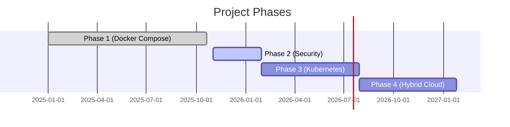

# Documentation Strategy for Continuous Development

## Executive Summary

This document defines a scalable documentation structure to support iterative development across multiple project phases (Phase 1 → Phase 5+), preventing documentation sprawl and maintaining clarity as the project grows.

**Current Challenge:** As you add Kubernetes, security scanning, service mesh, etc., the current monolithic approach will become unwieldy (ARCHITECTURE.md is already 1,461 lines).

**Proposed Solution:** Modular, phase-based documentation with clear separation of concerns and automated cross-linking.

---

## Current State Analysis

### Documentation Inventory

| File | Lines | Status | Issue |
|------|-------|--------|-------|
| ARCHITECTURE.md | 1,461 | Phase 1 complete | Will balloon with K8s, service mesh |
| IMPLEMENTATION-GUIDE.md | 2,754 | Phase 1 complete | Already very large, hard to navigate |
| DESIGN-DECISIONS.md | 1,382 | Phase 1 complete | Growing linearly with each decision |
| JOURNEY.md | 843 | Phase 1 complete | Narrative format, OK for growth |
| troubleshooting/trace-search.md | 533 | Specific issue | Good pattern for future playbooks |
| deployment-verification.md | 631 | Operational | Will expand with each phase |

### Problems with Current Structure

1. **Monolithic Documents**
   - ARCHITECTURE.md combines infrastructure + CI/CD + app + observability
   - Will become unmaintainable when adding K8s + service mesh + cloud
   - Hard to find specific information

2. **No Phase Separation**
   - Phase 1 (Docker Compose) mixed with future Phase 3 (Kubernetes) references
   - Readers can't easily understand "what's current vs. what's planned"

3. **Troubleshooting Scattered**
   - `troubleshooting/trace-search.md` is separate (good!)
   - But other troubleshooting is buried in IMPLEMENTATION-GUIDE.md
   - No consistent pattern for operational playbooks

4. **Design Decisions Growing Linearly**
   - DD-001, DD-002, DD-003... will reach DD-100+
   - Hard to group by phase or domain

---

## Proposed Documentation Architecture

### 1. Phase-Based Structure

```
docs/
├── README.md                          # Documentation index
│
├── phase-1-docker-compose/            # Current state
│   ├── ARCHITECTURE.md                # Infrastructure, CI/CD, app stack
│   ├── DESIGN-DECISIONS.md            # Phase 1 specific decisions
│   ├── IMPLEMENTATION-GUIDE.md        # Docker Compose setup guide
│   ├── deployment-verification.md     # Phase 1 validation
│   └── troubleshooting/
│       ├── trace-search.md
│       ├── nginx-502-errors.md
│       └── metrics-duplication.md
│
├── phase-2-security-scanning/         # Next iteration
│   ├── ARCHITECTURE.md                # Security pipeline additions
│   ├── DESIGN-DECISIONS.md            # SonarQube vs Snyk, etc.
│   ├── IMPLEMENTATION-GUIDE.md        # OPA/Rego setup
│   ├── deployment-verification.md     # Security checks
│   └── troubleshooting/
│       ├── opa-policy-failures.md
│       └── sonarqube-integration.md
│
├── phase-3-kubernetes/                # Future
│   ├── ARCHITECTURE.md                # K8s cluster, Helm charts
│   ├── DESIGN-DECISIONS.md            # StatefulSet vs Deployment
│   ├── IMPLEMENTATION-GUIDE.md        # Migration from Compose
│   ├── deployment-verification.md     # K8s health checks
│   └── troubleshooting/
│       ├── pod-crashloopbackoff.md
│       ├── pvc-mounting-issues.md
│       └── service-mesh-mtls.md
│
├── phase-4-hybrid-cloud/
├── phase-5-advanced-topics/
│
├── cross-cutting/                      # Shared across phases
│   ├── observability-fundamentals.md  # Three pillars, SLI/SLO
│   ├── traceql-reference.md           # Query language guide
│   ├── promql-reference.md
│   └── security-baseline.md           # SSH keys, fail2ban, etc.
│
├── playbooks/                          # Operational runbooks
│   ├── incident-response.md
│   ├── rollback-procedure.md
│   ├── backup-restore.md
│   └── disaster-recovery.md
│
└── templates/                          # For new phases
    ├── ARCHITECTURE-template.md
    ├── DESIGN-DECISIONS-template.md
    └── troubleshooting-template.md
```

### 2. README.md Navigation Structure

```markdown
# Observability Lab Documentation

## 🚀 Current Phase: Phase 1 - Docker Compose Stack
**Status:** ✅ Complete | **Last Updated:** 2025-10-20

### Quick Start
- [Phase 1 Architecture](phase-1-docker-compose/ARCHITECTURE.md)
- [Deployment Guide](phase-1-docker-compose/IMPLEMENTATION-GUIDE.md)
- [Verification Checklist](phase-1-docker-compose/deployment-verification.md)

---

## 📚 Documentation by Phase

### Phase 1: Docker Compose Foundation (✅ Complete)
**Scope:** On-prem VM, Docker Compose, Jenkins CI/CD, full observability stack

| Document | Purpose |
|----------|---------|
| [Architecture](phase-1-docker-compose/ARCHITECTURE.md) | Infrastructure, CI/CD, app stack |
| [Design Decisions](phase-1-docker-compose/DESIGN-DECISIONS.md) | Nginx proxy, metrics separation, etc. |
| [Implementation](phase-1-docker-compose/IMPLEMENTATION-GUIDE.md) | Step-by-step setup |
| [Troubleshooting](phase-1-docker-compose/troubleshooting/) | Common issues & fixes |

### Phase 2: Security & Policy (🚧 Planned)
**Scope:** OPA/Rego, SonarQube, Snyk, fail2ban, UFW

### Phase 3: Kubernetes Migration (📋 Design)
**Scope:** K8s cluster, Helm, StatefulSets, PostgreSQL

### Phase 4: Hybrid Cloud (💭 Concept)
**Scope:** AWS EKS, managed services, multi-region

---

## 🔧 Cross-Cutting Concerns
- [Observability Fundamentals](cross-cutting/observability-fundamentals.md)
- [TraceQL Reference](cross-cutting/traceql-reference.md)
- [Security Baseline](cross-cutting/security-baseline.md)

## 📖 Operational Playbooks
- [Incident Response](playbooks/incident-response.md)
- [Rollback Procedure](playbooks/rollback-procedure.md)
```

---

## Implementation Plan

### Step 1: Reorganize Current Documentation

**Move Phase 1 docs to subdirectory:**
```bash
mkdir -p docs/phase-1-docker-compose/troubleshooting
mv docs/ARCHITECTURE.md docs/phase-1-docker-compose/
mv docs/DESIGN-DECISIONS.md docs/phase-1-docker-compose/
mv docs/IMPLEMENTATION-GUIDE.md docs/phase-1-docker-compose/
mv docs/deployment-verification.md docs/phase-1-docker-compose/
mv docs/TRACE-SEARCH-TROUBLESHOOTING.md docs/phase-1-docker-compose/troubleshooting/trace-search.md
```

**Extract cross-cutting content:**
- Create `cross-cutting/observability-fundamentals.md` from ARCHITECTURE.md sections
- Create `cross-cutting/traceql-reference.md` from `troubleshooting/trace-search.md`
- Create `cross-cutting/promql-reference.md` from IMPLEMENTATION-GUIDE.md

### Step 2: Create Templates

**ARCHITECTURE-template.md:**
```markdown
# Phase X Architecture

## Overview
[1-2 paragraph summary]

## What's New in This Phase
- [ ] List of additions/changes from previous phase
- [ ] New components introduced
- [ ] Deprecated/removed components

## Architecture Diagram
[Mermaid/ASCII diagram]

## Component Details
### New Component 1
### New Component 2

## Integration with Previous Phases
[How this builds on Phase X-1]

## Migration Path
[From Phase X-1 to Phase X]

## References
- [Phase X-1 Architecture](../phase-X-1/ARCHITECTURE.md)
- [Design Decisions](DESIGN-DECISIONS.md)
```

**DESIGN-DECISIONS-template.md:**
```markdown
# Phase X Design Decisions

## Decision Summary
| ID | Decision | Status |
|----|----------|--------|
| DD-X-001 | [Title] | ✅ Implemented |

## DD-X-001: [Title]
**Date:** YYYY-MM-DD
**Status:** ✅ Implemented / 🚧 In Progress / ❌ Rejected
**Context:** What problem is being solved?
**Decision:** What was chosen?
**Alternatives Considered:**
- Option A: Pros/Cons
- Option B: Pros/Cons
**Consequences:**
- Positive:
- Negative:
**Related Decisions:**
- [DD-X-002](DESIGN-DECISIONS.md#dd-x-002)
```

**troubleshooting-template.md:**
```markdown
# [Component] Troubleshooting

## Problem: [Short description]
**Symptoms:**
- Symptom 1
- Symptom 2

**Root Cause:**
[Explanation]

**Solution:**
```bash
# Step-by-step fix
```

**Prevention:**
[How to avoid in future]

**Related Issues:**
- [Issue #123](link)
```

### Step 3: Create Phase Navigation

**docs/README.md** becomes the master index with:
```markdown
## Current State
**Active Phase:** Phase 1
**Next Phase:** Phase 2 (Planned start: Q1 2026)

## Phase Timeline

```

### Step 4: Automation

**Create `docs/generate-index.sh`:**
```bash
#!/bin/bash
# Auto-generate table of contents for each phase

for phase in docs/phase-*/; do
    echo "# ${phase} Documentation" > "${phase}/README.md"
    echo "" >> "${phase}/README.md"
    echo "## Documents" >> "${phase}/README.md"
    ls -1 "${phase}"*.md | xargs -I {} basename {} | while read file; do
        title=$(grep "^# " "${phase}/${file}" | head -1 | sed 's/# //')
        echo "- [${title}](${file})" >> "${phase}/README.md"
    done
done
```

---

## Benefits of This Approach

### 1. Scalability
- ✅ Each phase is self-contained
- ✅ ARCHITECTURE.md stays focused on that phase's scope
- ✅ Easy to archive old phases without deleting

### 2. Discoverability
- ✅ Clear "what phase am I in?" context
- ✅ Troubleshooting grouped by phase
- ✅ Cross-cutting concerns separated

### 3. Maintainability
- ✅ Templates ensure consistency
- ✅ Design decisions use phase-prefixed IDs (DD-1-001, DD-2-001)
- ✅ No single file exceeds 1,000 lines

### 4. Onboarding
- ✅ New contributors start with Phase 1 docs
- ✅ Clear progression path
- ✅ Operational playbooks separated from architecture

### 5. Historical Context
- ✅ Can see evolution across phases
- ✅ Migration paths documented
- ✅ Design decision rationale preserved

---

## Alternative Approaches (Considered & Rejected)

### Alt 1: Git Branches per Phase
**Pros:** Complete isolation
**Cons:** Hard to cross-reference, merge conflicts, loses history
**Verdict:** ❌ Too complex for documentation

### Alt 2: Obsidian/Wiki-Style Linking
**Pros:** Great for exploration
**Cons:** Requires special tooling, not GitHub-native
**Verdict:** ❌ Want plain Markdown

### Alt 3: Single Growing ARCHITECTURE.md
**Pros:** Everything in one place
**Cons:** Already 1,461 lines, will become 10,000+
**Verdict:** ❌ Current problem being solved

### Alt 4: Docusaurus/GitBook
**Pros:** Beautiful rendering, search
**Cons:** Build step, hosting, overkill for now
**Verdict:** 🤔 Consider for Phase 4+

---

## Migration Checklist

### Phase 1 (Immediate - Before Phase 2)
- [ ] Create `docs/phase-1-docker-compose/` directory
- [ ] Move existing docs to phase-1 folder
- [ ] Create `docs/phase-1-docker-compose/troubleshooting/` subdirectory
- [ ] Split `troubleshooting/trace-search.md` → dedicated traceql/correlation guides
- [ ] Extract observability fundamentals to cross-cutting/
- [ ] Create templates/ directory with 3 templates
- [ ] Update README.md with phase navigation
- [ ] Create docs/README.md as master index
- [ ] Test all links

### Phase 2 (When Starting Security Work)
- [ ] Copy templates to `docs/phase-2-security-scanning/`
- [ ] Fill in Architecture for security additions
- [ ] Document OPA/Rego decisions (DD-2-001, DD-2-002, etc.)
- [ ] Create troubleshooting/opa-policy-failures.md
- [ ] Update docs/README.md with Phase 2 status
- [ ] Cross-link Phase 1 → Phase 2 dependencies

### Ongoing
- [ ] Run `generate-index.sh` before each commit
- [ ] Keep troubleshooting playbooks to <200 lines each
- [ ] Document decisions promptly after implementation
- [ ] Revisit cross-cutting docs regularly for updates

---

## File Naming Conventions

### Phase Directories
```
phase-X-descriptive-name/
```
Examples:
- `phase-1-docker-compose/`
- `phase-2-security-scanning/`
- `phase-3-kubernetes/`

### Core Documents (Always Present)
```
ARCHITECTURE.md
DESIGN-DECISIONS.md
IMPLEMENTATION-GUIDE.md
deployment-verification.md
```

### Troubleshooting Playbooks
```
troubleshooting/
├── component-name-issue.md
├── service-failure-mode.md
└── integration-problem.md
```

### Cross-Cutting
```
cross-cutting/
├── topic-name.md
└── reference-guide.md
```

---

## Document Size Guidelines

| Document Type | Max Lines | Reason |
|---------------|-----------|--------|
| ARCHITECTURE.md | 1,000 | Should be scannable in 10 minutes |
| IMPLEMENTATION-GUIDE.md | 1,500 | Step-by-step, OK to be longer |
| DESIGN-DECISIONS.md | 1,000 | Extract old decisions to archive |
| Troubleshooting playbook | 200 | One issue per file |
| Cross-cutting reference | 500 | Quick lookup, not tutorial |

**When a file exceeds limit:**
1. Split by subtopic
2. Move to subdirectory
3. Create index file with links

---

## Example: Adding Phase 2 (Security Scanning)

### 1. Create Structure
```bash
mkdir -p docs/phase-2-security-scanning/troubleshooting
cp docs/templates/ARCHITECTURE-template.md docs/phase-2-security-scanning/ARCHITECTURE.md
cp docs/templates/DESIGN-DECISIONS-template.md docs/phase-2-security-scanning/DESIGN-DECISIONS.md
```

### 2. Fill in Architecture
```markdown
# Phase 2 Architecture: Security Scanning & Policy

## What's New in This Phase
- OPA/Rego policy engine in CI/CD
- SonarQube for SAST
- Snyk for dependency scanning
- Trivy for container image scanning
- JFrog Artifactory for artifact management

## Integration with Phase 1
- Jenkins pipeline adds security scanning stage
- Failing policies block deployment
- Artifacts stored in Artifactory before deployment
- Observability tracks policy failures as metrics

## Architecture Diagram
[Phase 1 base + Security additions highlighted]
```

### 3. Document Decisions
```markdown
## DD-2-001: OPA vs Kyverno
**Decision:** OPA with Conftest CLI
**Rationale:** Works with Docker Compose, will carry to K8s
```

### 4. Create Troubleshooting
```markdown
# OPA Policy Failures

## Problem: Pipeline blocked by policy violation
**Symptoms:**
- Jenkins build fails at "Policy Check" stage
- Error: "root container not allowed"

**Solution:**
Update Dockerfile to use non-root user...
```

### 5. Update Master Index
```markdown
### Phase 2: Security & Policy (🚧 In Progress)
**Started:** 2025-11-01
**Scope:** OPA/Rego, SonarQube, Snyk, Trivy, JFrog Artifactory

| Document | Status |
|----------|--------|
| [Architecture](phase-2-security-scanning/ARCHITECTURE.md) | ✅ Complete |
| [Design Decisions](phase-2-security-scanning/DESIGN-DECISIONS.md) | 🚧 In Progress |
```

---

## Tooling Recommendations

### Now (Phase 1 → 2 transition)
- ✅ Plain Markdown + GitHub
- ✅ Mermaid diagrams (GitHub renders natively)
- ✅ Bash scripts for index generation
- ✅ GitHub Actions for link checking

### Later (Phase 3+)
- 🤔 Consider Docusaurus if docs exceed 50 files
- 🤔 Add search with Algolia
- 🤔 Auto-generate architecture diagrams from code

### Automation Scripts to Create

**`docs/scripts/check-links.sh`:**
```bash
#!/bin/bash
# Validate all markdown links
find docs -name "*.md" -exec markdown-link-check {} \;
```

**`docs/scripts/generate-toc.sh`:**
```bash
#!/bin/bash
# Auto-generate table of contents for README.md
gh-md-toc README.md > README-TOC.md
```

**`docs/scripts/phase-stats.sh`:**
```bash
#!/bin/bash
# Show documentation stats per phase
for phase in docs/phase-*/; do
    echo "$(basename $phase): $(wc -l $phase/*.md | tail -1 | awk '{print $1}') lines"
done
```

---

## Success Metrics

### Documentation Health
- ✅ No file over 1,500 lines
- ✅ Every troubleshooting issue has a playbook
- ✅ Design decisions captured promptly after implementation
- ✅ Zero broken links (CI enforced)

### Usability
- ✅ New contributors can locate Phase 1 setup quickly via the docs index
- ✅ Troubleshooting playbook resolves issues without external search
- ✅ Architecture diagram matches deployed state (validated regularly)

### Maintenance
- ✅ Adding a new phase is straightforward (copy templates, fill in content)
- ✅ Cross-cutting docs are simple to update alongside new learnings
- ✅ Archiving an old phase follows a predictable checklist

---

## Rollout Plan

1. Restructure Phase 1 documentation (directories, moved files).
2. Extract cross-cutting content and create reusable templates.
3. Validate the structure by outlining the next phase with the templates.
4. Add automation (link checker, index generator, CI) to enforce standards.
5. Update narrative docs and gather feedback from prospective contributors.

---

## Conclusion

**Recommendation:** Implement phase-based structure **before** starting Phase 2.

**Why now:**
- Phase 1 docs are complete
- Phase 2 is planned but not started
- Perfect time to establish pattern
- Templates will guide Phase 2 documentation

**Expected outcome:**
- Scalable to 10+ phases without chaos
- Clear for new contributors
- Maintainable long-term
- Supports continuous development

**Next steps:**
1. Revisit this strategy
2. Create phase-1 directory structure
3. Test with Phase 2 outline
4. Commit when validated

---

**Document Version:** 1.0
**Last Updated:** 2025-10-20
**Status:** 📋 Proposal - Awaiting Approval
**Related:** DOCUMENTATION-REORGANIZATION.md (previous cleanup)
