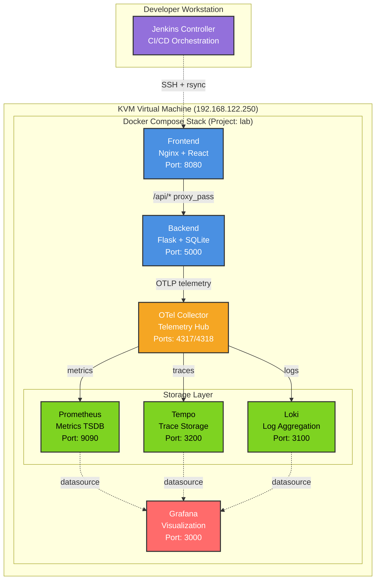

# System Architecture: On-Premises Observability Lab

## From Theory to Practice: Building a Production-Grade Monitoring Stack

**Version:** 1.0
**Status:** Production-Ready Proof of Concept
**Last Updated:** 2025-10-22

---

## Executive Summary

This document captures the complete architecture of a battle-tested, production-grade observability stack built as a **proof of concept for an-premises infrastructure simulation**. This project represents the foundation of my "On-Prem Domain" — a comprehensive learning environment designed to bridge the gap between cloud-native principles and traditional on-premises infrastructure management.

### What This Project Represents

This isn't just an observability lab. It's:

- **A Simulated On-Premises Environment** running on KVM/QEMU/libvirt virtualization
- **A CI/CD Testing Ground** deployed via Jenkins pipeline to a dedicated VM
- **A Migration Experimentation Platform** for testing cloud migration strategies
- **A Production Architecture Blueprint** demonstrating SRE best practices
- **A Foundation for Future Growth** (Kubernetes, Ansible, service mesh, hybrid cloud)

### The Journey Ahead

This proof of concept is the **first milestone** in a larger vision:

1. **Current State:** Docker Compose observability stack on VM
2. **Phase 2:** Policy as Code (OPA/Rego), SAST/DAST, artifact management
3. **Phase 3:** Ansible automation, kubernetes refactoring, Istio, Envoy, ArgoCD, Helm
4. **Phase 4:** Cloud-native AWS migration, ECS & EKS iteration

---

## Architecture Documentation Structure

This architecture documentation has been modularized for maintainability and clarity. Each section below links to a dedicated document:

### ✅ Completed Sections

1. **[Infrastructure Foundation](architecture/infrastructure.md)**
   - KVM/QEMU/libvirt Virtualization
   - VM Configuration and Resource Allocation
   - Operating System and Base Infrastructure
   - Storage Architecture
   - **Status:** ✅ Complete

2. **[CI/CD Pipeline Architecture](architecture/cicd-pipeline.md)**
   - Jenkins Control Plane
   - Six-Stage Deployment Pipeline
   - SSH + rsync Deployment Strategy
   - Smoke Testing and Verification
   - **Status:** ✅ Complete

3. **[Application Architecture](architecture/application.md)**
   - Flask Backend (Python 3.12)
   - React Frontend (Node.js 20)
   - SQLite Database
   - API Design and Endpoints
   - **Status:** ✅ Complete

4. **[Observability Architecture](architecture/observability.md)**
   - OpenTelemetry Collector
   - Prometheus (Metrics)
   - Tempo (Traces)
   - Loki (Logs)
   - Grafana (Visualization)
   - **Status:** ✅ Complete

5. **[Network Architecture](architecture/network.md)**
   - Docker Bridge Networking
   - Nginx Reverse Proxy
   - CORS Configuration (Hybrid: Nginx + Flask)
   - Service Discovery
   - **Status:** ✅ Complete

6. **[System Integration](architecture/integration.md)**
   - Service Dependencies (depends_on chains)
   - Data Flow (Traces, Metrics, Logs)
   - Inter-Component Communication
   - Healthcheck Dependencies
   - **Status:** ✅ Complete

7. **[Production Deployment](architecture/deployment.md)**
   - Jenkins 6-Stage CI/CD Pipeline
   - Manual Deployment with start-lab.sh
   - Docker Compose Orchestration
   - Healthcheck Validation
   - Smoke Testing Procedures
   - Rollback Procedures (3 strategies)
   - **Status:** ✅ Complete

8. **[Future Roadmap](architecture/roadmap.md)**
   - Phase 2-4 Planning (Q1-Q4 2026+)
   - Migration Strategies (Docker Compose → K8s → AWS)
   - Technology Evaluation (30+ tools assessed)
   - Timeline Estimates
   - Learning Objectives by Phase
   - **Status:** ✅ Complete (Extracted from README.md, JOURNEY.md)

---

## Quick Reference

### System Overview

### Key Technologies

- **Virtualization:** KVM/QEMU, libvirt
- **CI/CD:** Jenkins 2.479.2, SSH key-based authentication
- **Container Orchestration:** Docker Compose
- **Frontend:** React 18, Nginx 1.27.0-alpine
- **Backend:** Flask 3.0.0, Python 3.12, SQLAlchemy 2.0.23
- **Observability:** OpenTelemetry, Prometheus 2.48.1, Tempo 2.3.1, Loki 2.9.3, Grafana 10.2.3

### Network Endpoints

| Service    | Internal Port | External Access      | Purpose                    |
|------------|---------------|----------------------|----------------------------|
| Frontend   | 80            | http://VM_IP:80      | User interface             |
| Backend    | 5000          | (via Nginx proxy)    | REST API                   |
| Grafana    | 3000          | http://VM_IP:3000    | Observability dashboards   |
| Prometheus | 9090          | http://VM_IP:9090    | Metrics storage/query      |

---

## Design Philosophy

This architecture embodies several key principles:

1. **On-Premises First:** Simulates traditional infrastructure challenges (VM management, SSH deployment, network isolation)
2. **Production-Grade Patterns:** Healthchecks, graceful degradation, comprehensive observability
3. **Defense in Depth:** Multiple layers of CORS + proxy, extensive error handling
4. **Observability as Code:** Instrumentation built into application from day one
5. **CI/CD Automation:** Jenkins pipeline validates, deploys, and smoke-tests every change

---

## Related Documentation

- **[Journey Documentation](JOURNEY.md)** - The story of building this project, battle-tested troubleshooting
- **[Design Decisions](DESIGN-DECISIONS.md)** - Comprehensive rationale for every technical choice
- **[Implementation Guide](IMPLEMENTATION-GUIDE.md)** - Step-by-step setup instructions
- **[Verification Guide](VERIFICATION-GUIDE.md)** - Deployment verification and CI/CD testing procedures
- **[Troubleshooting Guides](troubleshooting/)** - Common issues and solutions

---

## Document Status

**Last Updated:** October 22, 2025
**Status:** Production-Ready
**Modularization:** 8/8 sections complete ✅

### Documentation Overview

- ✅ **Infrastructure Foundation:** Complete
- ✅ **CI/CD Pipeline:** Complete
- ✅ **Application:** Complete
- ✅ **Observability:** Complete
- ✅ **Network:** Complete
- ✅ **Integration:** Complete
- ✅ **Deployment:** Complete
- ✅ **Roadmap:** Complete

**Total Documentation:**
- 8 modular architecture files (~200KB total)
- **Comprehensive coverage** of all system components

---

**Next:** Start with [Infrastructure Foundation](architecture/infrastructure.md) to understand the base layer, or jump to any section that interests you.

---

**Phase 1 Documentation Set v1.0** | Last Reviewed: October 22, 2025
