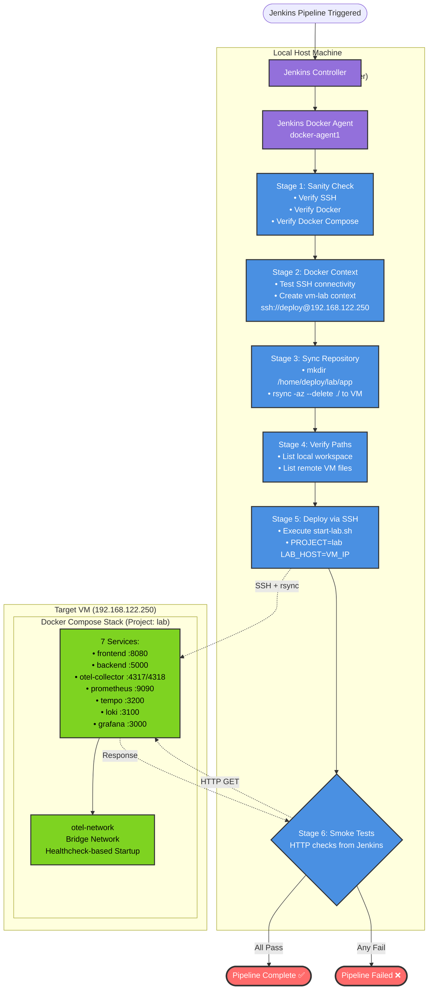

# Production Deployment Architecture

## Overview

This document describes the comprehensive deployment architecture for the OpenTelemetry Observability Lab. The system supports both **automated CI/CD deployment via Jenkins** and **manual local deployment** using the unified `start-lab.sh` script.

**Key Characteristics:**
- **Dual Deployment Paths:** CI/CD pipeline and manual deployment
- **SSH + rsync Strategy:** Secure remote deployment without Docker daemon exposure
- **Healthcheck-Based Orchestration:** Eliminates race conditions during startup
- **Unified Deployment Script:** Single script used by both Jenkins and developers
- **Comprehensive Validation:** Smoke tests and post-deployment verification

---

## Table of Contents

- [Overview](#overview)
- [Deployment Strategies Overview](#deployment-strategies-overview)
- [Jenkins CI/CD Pipeline Deployment](#jenkins-cicd-pipeline-deployment)
- [Manual Local Deployment](#manual-local-deployment)
- [Docker Compose Orchestration](#docker-compose-orchestration)
- [Healthcheck Validation](#healthcheck-validation)
- [Post-Deployment Verification](#post-deployment-verification)
- [Smoke Testing Procedures](#smoke-testing-procedures)
- [Rollback Procedures](#rollback-procedures)
- [Environment Configuration](#environment-configuration)
- [Troubleshooting Deployments](#troubleshooting-deployments)
- [Best Practices](#best-practices)
- [Related Documentation](#related-documentation)
- [Appendix: Deployment Command Reference](#appendix-deployment-command-reference)

---

## Deployment Strategies Overview

The lab supports two primary deployment strategies, both using the same underlying Docker Compose configuration:

### Strategy Comparison

| Aspect | Jenkins CI/CD Pipeline | Manual Local Deployment |
|--------|------------------------|------------------------|
| **Trigger** | Git push to repository | Developer-initiated |
| **Location** | Remote VM (192.168.122.250) | Local dev machine or remote VM |
| **File Sync** | rsync over SSH | Files already local |
| **Execution** | Jenkins agent via SSH | Direct shell execution |
| **Validation** | Automated smoke tests | Manual verification |
| **Use Case** | Production/staging deployments | Development, testing, demos |

### Common Elements

Both strategies share:
- **Same deployment script:** `start-lab.sh`
- **Same Docker Compose config:** `docker-compose.yml`
- **Same healthcheck logic:** Defined in Compose file
- **Same environment variables:** `PROJECT` and `LAB_HOST`

---

## Jenkins CI/CD Pipeline Deployment

### Pipeline Architecture

The Jenkins pipeline executes a **6-stage deployment workflow** on a dedicated Docker agent:



### Stage-by-Stage Breakdown

#### Stage 1: Sanity on agent
**Purpose:** Validate Docker agent has required tools

**Commands Executed:**
```bash
which ssh                  # Verify SSH client installed
docker --version           # Verify Docker CLI available
docker compose version     # Verify Docker Compose v2 installed
```

**Success Criteria:**
- All three commands exit with status 0
- Output shows version numbers

**Common Failures:**
- Docker not installed on agent
- Docker Compose plugin missing

---

#### Stage 2: Ensure remote Docker context
**Purpose:** Create SSH-based Docker context for verification commands

**Commands Executed:**
```bash
# Test SSH connectivity
ssh -o StrictHostKeyChecking=no deploy@192.168.122.250 'echo ok'

# Create context if doesn't exist
docker context ls | grep -q "^vm-lab " || \
  docker context create vm-lab --docker "host=ssh://deploy@192.168.122.250"

# Verify context works
docker --context vm-lab info
```

**Success Criteria:**
- SSH connection succeeds
- Docker context created or already exists
- `docker info` returns VM's Docker daemon info

**Why This Works:**
- Docker context uses SSH tunnel to connect to remote daemon
- Credentials handled by `sshagent` credential binding
- Enables verification commands like `docker --context vm-lab ps`

**Important Note:**
- Context is for **verification only**, not deployment
- Actual deployment uses direct SSH commands for consistency

---

#### Stage 3: Sync repo to VM
**Purpose:** Transfer all files to VM for Docker Compose bind mounts

**Commands Executed:**
```bash
# Create deployment directory if doesn't exist
ssh deploy@192.168.122.250 "mkdir -p /home/deploy/lab/app"

# Synchronize entire repository
rsync -az --delete ./ deploy@192.168.122.250:/home/deploy/lab/app/
```

**rsync Flags Explained:**
- `-a`: Archive mode (preserves permissions, timestamps, symlinks)
- `-z`: Compress data during transfer
- `--delete`: Remove files on destination that don't exist in source

**Why rsync (Not Docker Copy):**
- Docker Compose bind mounts require files on VM's filesystem
- Examples: `./frontend/default.conf`, `./grafana/dashboards/*.json`
- rsync ensures complete synchronization with minimal transfer time

**Success Criteria:**
- rsync exits with status 0
- No "permission denied" errors
- Files visible on VM after sync

---

#### Stage 4: Debug: verify compose paths
**Purpose:** Validate file structure before deployment

**Commands Executed:**
```bash
# List local workspace
pwd
ls -la

# List remote VM directory and find docker-compose files
ssh deploy@192.168.122.250 "ls -la /home/deploy/lab/app || true; \
  find /home/deploy/lab/app -maxdepth 2 -type f \
    \( -name 'docker-compose.yml' -o -name 'docker-compose.yaml' \) -print"
```

**Success Criteria:**
- `docker-compose.yml` found on VM
- All config directories present (backend/, frontend/, otel-collector/, grafana/)

**Troubleshooting Use:**
- If Stage 5 fails, these logs show whether files synced correctly
- Helps identify rsync permission issues

---

#### Stage 5: Compose up (remote via SSH)
**Purpose:** Execute deployment script on VM

**Commands Executed:**
```bash
export DOCKER_BUILDKIT=1

ssh deploy@192.168.122.250 "
  cd /home/deploy/lab/app && \
  PROJECT=lab LAB_HOST=192.168.122.250 ./start-lab.sh
"
```

**Environment Variables Passed:**
- `DOCKER_BUILDKIT=1`: Enable BuildKit for optimized image builds
- `PROJECT=lab`: Docker Compose project name (container prefix)
- `LAB_HOST=192.168.122.250`: Display correct access URLs in script output

**What start-lab.sh Does:**
1. Validates Docker and Docker Compose availability
2. Runs `docker compose -p lab down -v` (clean slate)
3. Runs `docker compose -p lab up -d --build` (rebuild and start)
4. Waits 10 seconds for services to stabilize
5. Executes healthchecks on all services
6. Displays service status and access URLs

**Success Criteria:**
- Script exits with status 0
- All services show "Up" or "Up (healthy)" status
- Healthchecks pass for backend, Prometheus, Grafana, Tempo, Loki

**Common Failures:**
- Backend healthcheck fails (Python metrics endpoint issue)
- DNS resolution failure in frontend (Nginx can't resolve backend)
- Image build failures (network issues, syntax errors)

---

#### Stage 6: Smoke tests
**Purpose:** Validate deployed services are responding

**Commands Executed:**
```bash
curl -sf http://192.168.122.250:8080 >/dev/null || true
curl -sf http://192.168.122.250:3000/login >/dev/null || true
curl -sf http://192.168.122.250:9090/-/ready >/dev/null || true
```

**Services Tested:**
- **Frontend (port 8080):** User interface availability
- **Grafana (port 3000):** Login page accessible
- **Prometheus (port 9090):** Ready endpoint responding

**Why These Endpoints:**
- Frontend validates Nginx + backend connectivity
- Grafana validates observability dashboard access
- Prometheus validates metrics collection pipeline

**Success Criteria:**
- All three curl commands return HTTP 200
- `-f` flag causes curl to fail on HTTP errors (4xx, 5xx)

---

### SSH Security Architecture

The Jenkins pipeline uses **key-based authentication** with ED25519 keys:

**Security Hardening Applied:**
1. **Password authentication disabled:** Only SSH keys accepted
2. **Dedicated deploy user:** Non-root user with minimal permissions
3. **ED25519 keys:** Modern, fast, 256-bit cryptographic keys
4. **SSH agent forwarding:** Credentials never stored on Jenkins agent
5. **StrictHostKeyChecking:** Prevents MITM attacks

**Implementation:**
```bash
# Generate key pair (done once)
ssh-keygen -t ed25519 -f ~/.ssh/id_ed25519_jenkins

# Install public key on VM
ssh-copy-id -i ~/.ssh/id_ed25519_jenkins.pub deploy@192.168.122.250

# Lock deploy user password (key-only auth)
sudo passwd -l deploy

# Disable password auth in /etc/ssh/sshd_config
PasswordAuthentication no
ChallengeResponseAuthentication no
```

**Jenkins Credential Configuration:**
1. Store private key in Jenkins credentials as "vm-ssh"
2. Use `sshagent` credential binding in pipeline
3. Key loaded into SSH agent only during pipeline execution

---

### Pipeline Environment Variables

Defined in Jenkinsfile `environment` block:

| Variable | Value | Purpose | Override Allowed |
|----------|-------|---------|------------------|
| `VM_USER` | `deploy` | SSH user on target VM | No |
| `VM_IP` | `192.168.122.250` | Target VM IP address | Yes (for multi-VM) |
| `DOCKER_CTX` | `vm-lab` | Docker context name | No |
| `PROJECT` | `lab` | Docker Compose project name | No |
| `VM_DIR` | `/home/deploy/lab/app` | Deployment directory | Yes (for multi-path) |

**How to Override (Example: Deploy to Different VM):**
```groovy
environment {
  VM_IP = '192.168.122.251'  // Change target VM
  VM_DIR = '/opt/lab'        // Change deployment path
}
```

---

### Post-Deployment Actions

Defined in Jenkinsfile `post` block:

```groovy
post {
  failure {
    echo "Hint: tail remote logs → docker --context vm-lab compose \
      --project-directory /home/deploy/lab/app -p lab logs --no-color --tail=200"
  }
}
```

**What This Does:**
- On pipeline failure, prints command to view remote container logs
- Helps developers quickly diagnose deployment issues
- Uses Docker context for remote log retrieval

**Manual Troubleshooting:**
```bash
# View all container logs (last 200 lines)
docker --context vm-lab compose \
  --project-directory /home/deploy/lab/app -p lab logs --tail=200

# View specific service logs
docker --context vm-lab compose \
  --project-directory /home/deploy/lab/app -p lab logs backend --tail=50

# Check container status
docker --context vm-lab ps -a
```

---

## Manual Local Deployment

### Overview

Developers can deploy the lab locally or to a VM using the same `start-lab.sh` script that Jenkins uses. This ensures **deployment parity** between development and production.

### Prerequisites

**Local System:**
- Docker Engine 20.10+ or Docker Desktop
- Docker Compose v2 (plugin, not standalone)
- Bash shell (Linux, macOS, WSL2)

**Remote VM (Optional):**
- SSH access with key-based authentication
- Docker and Docker Compose installed
- Repository files synced via git or rsync

### Deployment Steps

#### Option 1: Local Deployment

**Use Case:** Testing on developer workstation

```bash
# Clone repository
cd ~/workspace
git clone <repository-url>
cd Opentelemetry_Observability_Lab

# Run deployment script
./start-lab.sh
```

**What Happens:**
1. Script validates Docker/Compose availability
2. Uses default `PROJECT=lab` and `LAB_HOST=localhost`
3. Stops existing containers
4. Builds and starts all services
5. Runs healthchecks
6. Displays access URLs with `localhost`

**Access Points (Local):**
```
Frontend:    http://localhost:8080
Grafana:     http://localhost:3000
Prometheus:  http://localhost:9090
Tempo:       http://localhost:3200
```

---

#### Option 2: Remote VM Deployment (Manual)

**Use Case:** Testing on staging VM, manual production deployment

**Step 1: Sync Files to VM**
```bash
# From local machine
rsync -az --delete ./ deploy@192.168.122.250:/home/deploy/lab/app/
```

**Step 2: SSH to VM and Deploy**
```bash
ssh deploy@192.168.122.250
cd /home/deploy/lab/app

# Run with VM IP for correct URLs
PROJECT=lab LAB_HOST=192.168.122.250 ./start-lab.sh
```

**Access Points (Remote VM):**
```
Frontend:    http://192.168.122.250:8080
Grafana:     http://192.168.122.250:3000
Prometheus:  http://192.168.122.250:9090
Tempo:       http://192.168.122.250:3200
```

---

### start-lab.sh Script Internals

The script performs the following operations:

```bash
#!/bin/bash

# 1. Display banner and configuration
echo "OpenTelemetry Observability Lab"
PROJECT="${PROJECT:-lab}"
LAB_HOST="${LAB_HOST:-localhost}"
echo "Using project name: ${PROJECT}"
echo "Using access host: ${LAB_HOST}"

# 2. Validate Docker is running
if ! docker info > /dev/null 2>&1; then
    echo "Error: Docker is not running. Please start Docker and try again."
    exit 1
fi

# 3. Validate Docker Compose is available
if ! docker compose version &> /dev/null; then
    echo "Error: docker compose is not installed. Please install it and try again."
    exit 1
fi

# 4. Clean up existing containers and volumes
echo "Cleaning up existing containers..."
docker compose -p ${PROJECT} down -v 2>/dev/null

# 5. Build and start all services
echo "Starting services with project name: ${PROJECT}"
export DOCKER_BUILDKIT=1
docker compose -p ${PROJECT} up -d --build

# 6. Wait for services to stabilize
echo "Waiting for services to start..."
sleep 10

# 7. Display container status
echo "Container Status:"
docker compose -p ${PROJECT} ps

# 8. Run healthchecks on all services
echo "Checking service health..."

# OpenTelemetry Collector (port 13133: health_check extension)
if curl -s http://localhost:13133 > /dev/null 2>&1; then
    echo "✓ OpenTelemetry Collector: Healthy"
else
    echo "⚠ OpenTelemetry Collector: Starting..."
fi

# Flask Backend (port 5000: /health endpoint)
if curl -s http://localhost:5000/health > /dev/null 2>&1; then
    echo "✓ Flask Backend: Healthy"
else
    echo "⚠ Flask Backend: Starting..."
fi

# Grafana (port 3000: root endpoint)
if curl -s http://localhost:3000 > /dev/null 2>&1; then
    echo "✓ Grafana: Healthy"
else
    echo "⚠ Grafana: Starting..."
fi

# Prometheus (port 9090: /-/healthy endpoint)
if curl -s http://localhost:9090/-/healthy > /dev/null 2>&1; then
    echo "✓ Prometheus: Healthy"
else
    echo "⚠ Prometheus: Starting..."
fi

# Tempo (port 3200: /ready endpoint)
if curl -s http://localhost:3200/ready > /dev/null 2>&1; then
    echo "✓ Tempo: Healthy"
else
    echo "⚠ Tempo: Starting..."
fi

# Loki (port 3100: /ready endpoint)
if curl -s http://localhost:3100/ready > /dev/null 2>&1; then
    echo "✓ Loki: Healthy"
else
    echo "⚠ Loki: Starting..."
fi

# 9. Display access URLs and usage tips
echo "Lab is ready!"
echo "Access Points:"
echo "   Frontend:    http://${LAB_HOST}:8080"
echo "   Grafana:     http://${LAB_HOST}:3000"
echo "   Prometheus:  http://${LAB_HOST}:9090"
echo "   Tempo:       http://${LAB_HOST}:3200"
echo ""
echo "Tips:"
echo "   - View logs:    docker compose -p ${PROJECT} logs -f [service-name]"
echo "   - Stop lab:     docker compose -p ${PROJECT} down"
echo "   - Restart:      docker compose -p ${PROJECT} restart [service-name]"
echo "   - List status:  docker compose -p ${PROJECT} ps"
echo ""
echo "⚠ Note: When using project name '${PROJECT}', always include '-p ${PROJECT}'"
echo "   in your docker compose commands for proper container management."
```

### Environment Variables Used by start-lab.sh

| Variable | Default | Purpose | When to Override |
|----------|---------|---------|------------------|
| `PROJECT` | `lab` | Docker Compose project name | Testing multiple instances |
| `LAB_HOST` | `localhost` | Display host in URLs | Deploying to remote VM |
| `DOCKER_BUILDKIT` | `1` | Enable BuildKit (set in script) | Never (performance optimization) |

**Override Examples:**
```bash
# Run second instance on same machine
PROJECT=lab2 ./start-lab.sh

# Deploy to VM with correct access URLs
PROJECT=lab LAB_HOST=192.168.122.250 ./start-lab.sh

# Custom project name for testing
PROJECT=test-lab ./start-lab.sh
```

---

## Docker Compose Orchestration

### Service Startup Dependencies

Docker Compose uses `depends_on` with healthchecks to ensure proper startup order:

```yaml
services:
  backend:
    depends_on:
      - otel-collector
    healthcheck:
      test: ["CMD", "python", "-c", "import urllib.request; urllib.request.urlopen('http://localhost:5000/metrics', timeout=2).read()"]
      interval: 10s
      timeout: 3s
      retries: 5
      start_period: 5s

  otel-collector:
    depends_on:
      - tempo
      - loki
      - prometheus

  frontend:
    depends_on:
      backend:
        condition: service_healthy  # Waits for backend healthcheck to pass
```

### Startup Flow Diagram

```
┌─────────────────────────────────────────────────────────────┐
│  Stage 1: Infrastructure Services (No Dependencies)         │
├─────────────────────────────────────────────────────────────┤
│  • Prometheus        (metrics storage)                      │
│  • Tempo             (trace storage)                        │
│  • Loki              (log storage)                          │
├─────────────────────────────────────────────────────────────┤
│  ▼ All three services must be "Up" before next stage        │
└─────────────────────────────────────────────────────────────┘

┌─────────────────────────────────────────────────────────────┐
│  Stage 2: OpenTelemetry Collector                           │
├─────────────────────────────────────────────────────────────┤
│  • Depends on: Prometheus, Tempo, Loki                      │
│  • Exports metrics/traces/logs to backend services          │
├─────────────────────────────────────────────────────────────┤
│  ▼ Collector must be "Up" before next stage                 │
└─────────────────────────────────────────────────────────────┘

┌─────────────────────────────────────────────────────────────┐
│  Stage 3: Backend Application                               │
├─────────────────────────────────────────────────────────────┤
│  • Depends on: otel-collector                               │
│  • Healthcheck: /metrics endpoint validation                │
│  • Must reach "Up (healthy)" status                         │
├─────────────────────────────────────────────────────────────┤
│  ▼ Backend healthcheck must pass before next stage          │
└─────────────────────────────────────────────────────────────┘

┌─────────────────────────────────────────────────────────────┐
│  Stage 4: Frontend (Nginx)                                  │
├─────────────────────────────────────────────────────────────┤
│  • Depends on: backend (condition: service_healthy)         │
│  • Waits for backend to pass healthcheck                    │
│  • Resolves backend DNS name during startup                 │
├─────────────────────────────────────────────────────────────┤
│  ▼ Frontend starts only after backend is healthy            │
└─────────────────────────────────────────────────────────────┘

┌─────────────────────────────────────────────────────────────┐
│  Stage 5: Grafana (Visualization)                           │
├─────────────────────────────────────────────────────────────┤
│  • Depends on: Prometheus, Tempo, Loki                      │
│  • Loads datasources from provisioning directory            │
│  • Loads dashboards from provisioning directory             │
└─────────────────────────────────────────────────────────────┘
```

### Why This Ordering Matters

**Problem Solved:**
- **Frontend DNS Resolution Failure:** If Nginx starts before backend container exists, Docker's embedded DNS returns "no such host" error
- **OTLP Export Failures:** If backend starts before otel-collector, initial spans/metrics are lost
- **Grafana Datasource Errors:** If Grafana starts before backend services, datasource validation fails

**Solution:**
- `condition: service_healthy` ensures backend container not only exists but is **responding to requests**
- `depends_on` without condition ensures service **exists** (not necessarily ready)

---

### Project Name Impact

The `PROJECT` variable affects container naming and network isolation:

**Default (PROJECT=lab):**
```
CONTAINER NAME         COMPOSE SERVICE
lab-backend-1          backend
lab-frontend-1         frontend
lab-otel-collector-1   otel-collector
lab-prometheus-1       prometheus
lab-tempo-1            tempo
lab-loki-1             loki
lab-grafana-1          grafana
```

**Docker Network Name:**
```
lab_otel-network
```

**Impact on Commands:**
- Must use `-p lab` in all Docker Compose commands
- Example: `docker compose -p lab logs backend`
- Without `-p lab`, Docker Compose won't find containers

**Why This Matters:**
- Allows multiple lab instances on same machine
- Jenkins uses `PROJECT=lab` for consistency
- Developers can run `PROJECT=test` for parallel testing

---

## Healthcheck Validation

### Backend Healthcheck (Critical)

The backend healthcheck is the **most critical** dependency in the stack:

```yaml
healthcheck:
  test: ["CMD", "python", "-c", "import urllib.request; urllib.request.urlopen('http://localhost:5000/metrics', timeout=2).read()"]
  interval: 10s
  timeout: 3s
  retries: 5
  start_period: 5s
```

**What This Checks:**
1. Python process is running (can execute `python` command)
2. Flask application is listening on port 5000
3. `/metrics` endpoint responds (not just exists)
4. Response completes within 2 seconds

**Why /metrics Endpoint:**
- Always available (Prometheus client library)
- No database dependency (unlike API endpoints)
- No authentication required
- Validates Flask app initialization completed

**Timing Parameters:**
- `interval: 10s`: Check every 10 seconds
- `timeout: 3s`: Fail check if no response in 3 seconds
- `retries: 5`: Mark unhealthy after 5 consecutive failures
- `start_period: 5s`: Grace period for application startup

**Healthcheck States:**
1. **starting (0-15 seconds):** Initial grace period
2. **healthy:** Check passed, frontend can start
3. **unhealthy:** 5 consecutive failures, container marked bad

---

### Service Healthcheck Endpoints

Each service exposes a healthcheck endpoint used by `start-lab.sh`:

| Service | Port | Endpoint | Response | Purpose |
|---------|------|----------|----------|---------|
| **Backend** | 5000 | `/health` | `{"status": "healthy"}` | Flask app health |
| **Backend** | 5000 | `/metrics` | Prometheus text format | Metrics exporter health |
| **OTel Collector** | 13133 | `/` | JSON status | health_check extension |
| **Prometheus** | 9090 | `/-/healthy` | `Prometheus is Healthy.` | Storage engine health |
| **Tempo** | 3200 | `/ready` | `ready` | Query engine readiness |
| **Loki** | 3100 | `/ready` | `ready` | Query engine readiness |
| **Grafana** | 3000 | `/` | HTML (login page) | Web server responding |

**Implementation in start-lab.sh:**
```bash
# Example: Check if Prometheus is healthy
if curl -s http://localhost:9090/-/healthy > /dev/null 2>&1; then
    echo "✓ Prometheus: Healthy"
else
    echo "⚠ Prometheus: Starting..."
fi
```

**Why Warnings (Not Errors):**
- Services may still be starting when script checks
- 10-second wait may not be enough for all services
- Script reports status but doesn't fail deployment
- Allows users to re-check manually after waiting longer

---

### Healthcheck Troubleshooting

**Backend Shows "unhealthy":**
```bash
# View healthcheck logs
docker compose -p lab logs backend | grep -i health

# Common issues:
# - Python healthcheck command failing
# - /metrics endpoint not accessible
# - Flask app crashed during startup
# - SQLAlchemy event listener errors
```

**Frontend Shows "waiting":**
```bash
# Check if waiting on backend healthcheck
docker compose -p lab ps

# Expected: backend shows "Up (healthy)" before frontend starts
# If backend is "starting" for >30 seconds, investigate backend logs
```

**OTel Collector Shows Errors:**
```bash
# Check if dependent services (Prometheus, Tempo, Loki) are up
docker compose -p lab ps | grep -E "(prometheus|tempo|loki)"

# View collector logs for connection errors
docker compose -p lab logs otel-collector | grep -i error
```

---

## Post-Deployment Verification

After deployment completes, perform these verification steps to ensure the lab is fully operational.

### Quick Verification Checklist

Run these commands on the deployment host (local machine or VM):

```bash
# 1. Verify all containers are running
docker compose -p lab ps

# Expected output: All services show "Up" or "Up (healthy)"
# ✓ flask-backend (Up (healthy))
# ✓ frontend (Up)
# ✓ otel-collector (Up)
# ✓ prometheus (Up)
# ✓ tempo (Up)
# ✓ loki (Up)
# ✓ grafana (Up)

# 2. Check backend health
curl http://localhost:5000/health
# Expected: {"status": "healthy"}

# 3. Verify frontend API access (through Nginx)
curl http://localhost:8080/api/tasks
# Expected: [] (empty array or list of tasks)

# 4. Check Prometheus scrape targets
curl http://localhost:9090/api/v1/targets | jq '.data.activeTargets[] | select(.labels.job=="flask-backend") | {state: .health, lastScrape: .lastScrape}'
# Expected: {"state": "up", "lastScrape": "<recent timestamp>"}

# 5. Verify Grafana datasources
curl http://localhost:3000/api/datasources | jq '.[] | {name: .name, type: .type}'
# Expected: Prometheus, Tempo, Loki all listed
```

### Comprehensive Verification Guide

For detailed verification procedures, see **[VERIFICATION-GUIDE.md](../VERIFICATION-GUIDE.md)**:

1. **Backend Container Status** - Verify "Up (healthy)" status
2. **Backend Logs** - Check for event listener registration
3. **DNS Resolution** - Validate Docker DNS from frontend container
4. **API Connectivity** - Test backend→frontend network path
5. **Nginx Proxy** - Verify external access through Nginx
6. **Prometheus Metrics** - Check `/metrics` endpoint and scrape targets
7. **Grafana Data Sources** - Validate Prometheus, Tempo, Loki connections
8. **SLI/SLO Dashboard** - Verify all panels show data
9. **Database Latency** - Generate DB traffic and check P95 metrics
10. **Tempo Traces** - Validate distributed tracing is working

### Automated Health Check Script

The repository includes a quick health check script:

**Location:** Save as `health-check.sh` on deployment host

```bash
#!/bin/bash
# Quick health check for observability lab

echo "=== Observability Lab Health Check ==="
echo

echo "1. Container Status:"
docker compose -p lab ps | grep -E "(backend|frontend|prometheus|grafana)"
echo

echo "2. Backend Health:"
curl -s http://localhost:5000/health | jq -r '.status' && echo "✓ Backend: Healthy"
echo

echo "3. Frontend API:"
curl -s -o /dev/null -w "✓ HTTP %{http_code}\n" http://localhost:8080/api/tasks
echo

echo "4. Prometheus Target:"
curl -s http://localhost:9090/api/v1/targets 2>/dev/null | \
  jq -r '.data.activeTargets[] | select(.labels.job=="flask-backend") | "✓ flask-backend: \(.health)"'
echo

echo "5. Grafana:"
curl -s -o /dev/null -w "✓ HTTP %{http_code}\n" http://localhost:3000
echo

echo "=== Health Check Complete ==="
```

**Usage:**
```bash
chmod +x health-check.sh
./health-check.sh
```

---

## Smoke Testing Procedures

### Automated Smoke Tests (Jenkins Pipeline)

Jenkins runs three automated smoke tests in Stage 6:

```bash
# Test 1: Frontend availability
curl -sf http://192.168.122.250:8080 >/dev/null || true

# Test 2: Grafana login page
curl -sf http://192.168.122.250:3000/login >/dev/null || true

# Test 3: Prometheus ready endpoint
curl -sf http://192.168.122.250:9090/-/ready >/dev/null || true
```

**Flags Explained:**
- `-s`: Silent mode (no progress bar)
- `-f`: Fail on HTTP error status (4xx, 5xx)
- `>/dev/null`: Discard output (only check exit code)
- `|| true`: Currently prevents failure (see recommendations below)

**Current Limitation:**
- `|| true` means smoke tests can fail without failing pipeline
- This is temporary for debugging purposes

**Recommended Improvement:**
```groovy
stage('Smoke tests') {
  steps {
    sh '''
      set -eu
      echo "Testing frontend..."
      curl -sf http://${VM_IP}:8080
      echo "Testing Grafana..."
      curl -sf http://${VM_IP}:3000/login
      echo "Testing Prometheus..."
      curl -sf http://${VM_IP}:9090/-/ready
      echo "All smoke tests passed!"
    '''
  }
}
```

---

### Manual Smoke Test Procedures

After deployment, run these manual tests to validate functionality:

#### Test 1: Create Task (Generate Telemetry)

**Via Web UI:**
1. Open http://localhost:8080 (or VM_IP:8080)
2. Enter task title: "Test Task"
3. Click "Add Task"
4. Verify task appears in list

**Via API:**
```bash
curl -X POST http://localhost:8080/api/tasks \
  -H "Content-Type: application/json" \
  -d '{"title": "Test Task", "description": "Smoke test task"}'

# Expected response:
# {"id": 1, "title": "Test Task", "description": "Smoke test task", "completed": false, "created_at": "2025-10-22T12:00:00"}
```

**What This Tests:**
- Frontend→Backend connectivity
- Backend→Database writes
- OpenTelemetry instrumentation (trace generated)
- Prometheus metrics incremented (`http_requests_total`)

---

#### Test 2: View Metrics

```bash
curl http://localhost:5000/metrics | grep -E "(http_requests_total|db_query_duration_seconds)"
```

**Expected Output:**
```
http_requests_total{method="GET",endpoint="/api/tasks",status="200"} 5.0
http_requests_total{method="POST",endpoint="/api/tasks",status="201"} 1.0
db_query_duration_seconds_bucket{le="0.005",operation="SELECT"} 10.0
db_query_duration_seconds_bucket{le="0.01",operation="INSERT"} 1.0
```

**What This Tests:**
- Prometheus metrics export
- HTTP request tracking
- Database query duration tracking

---

#### Test 3: Generate DB Smoke Test

**Via Web UI:**
1. Click "DB Smoke (warm P95)" button
2. Wait for toast: "DB smoke test completed (300 operations)"

**Via API:**
```bash
curl "http://localhost:8080/api/smoke/db?ops=300&type=rw"

# Expected response:
# {"message": "DB smoke test completed", "operations": 300, "breakdown": {"SELECT": 150, "INSERT": 50, "UPDATE": 50, "DELETE": 50}}
```

**What This Tests:**
- Mixed read/write database operations
- DB query duration histogram population
- P95 latency metrics for Grafana dashboard

---

#### Test 4: View Traces in Grafana

1. Open http://localhost:3000
2. Navigate: **Explore** → **Tempo**
3. Select service: **flask-backend**
4. Click **Run Query**
5. Click any trace ID to view details

**Expected Trace Structure:**
```
POST /api/tasks (200ms)
├─ POST (Flask handler span) (190ms)
│  ├─ INSERT task_manager (SQLAlchemy span) (5ms)
│  └─ SELECT task_manager (SQLAlchemy span) (3ms)
└─ Metrics export (OTel exporter span) (10ms)
```

**What This Tests:**
- Distributed tracing pipeline (Backend → OTel → Tempo)
- Span hierarchy and context propagation
- Database operation tracing

---

#### Test 5: View SLI/SLO Dashboard

1. Open http://localhost:3000
2. Navigate: **Dashboards** → **SLI/SLO Dashboard - Task Manager**
3. Wait 30 seconds for data refresh

**Panels to Verify:**

| Panel | Expected State | How to Trigger Data |
|-------|----------------|---------------------|
| **Request Rate** | Shows line graph | Create tasks via UI |
| **Error Rate** | 0% | Click "Simulate Error" to test |
| **Request Duration P95** | 50-200ms | Create tasks via UI |
| **Database Query P95 Latency** | 5-50ms | Run DB smoke test |
| **Active Tasks** | Count of tasks | Create/delete tasks |

**What This Tests:**
- Prometheus scraping pipeline
- Grafana datasource connectivity
- PromQL query execution
- Dashboard panel rendering

---

### Load Testing (Optional)

Generate sustained load to test system under stress:

```bash
# Install Apache Bench (if not present)
sudo apt-get install apache2-utils

# Generate 1000 requests with 10 concurrent connections
ab -n 1000 -c 10 http://localhost:8080/api/tasks

# Monitor metrics in real-time
watch -n 1 'curl -s http://localhost:5000/metrics | grep http_requests_total'
```

**Monitoring During Load Test:**
1. Watch Grafana "Request Rate" panel (should spike)
2. Watch "Request Duration P95" (should increase)
3. Check container CPU/memory: `docker stats`

---

## Rollback Procedures

### When to Rollback

Trigger rollback if any of these conditions occur post-deployment:

- **Smoke tests fail:** Services not responding after 5 minutes
- **High error rate:** More than 5% of requests return 5xx errors
- **Backend crash loop:** Container repeatedly restarting
- **Prometheus target down:** flask-backend target shows "down" for >2 minutes
- **Data loss detected:** Database queries returning unexpected results

---

### Rollback Strategy

**Current Implementation:** Manual rollback via Git + redeploy

**Rollback Steps:**

#### Step 1: Identify Last Known Good Commit

```bash
# View recent commits
git log --oneline -10

# Example output:
# a1b2c3d (HEAD -> main) Update database schema (CURRENT - BROKEN)
# e4f5g6h Add new endpoint (LAST KNOWN GOOD)
# h7i8j9k Fix Nginx config
```

#### Step 2: Revert to Last Known Good Commit

```bash
# Option A: Revert single commit (keeps history)
git revert a1b2c3d
git push origin main

# Option B: Hard reset (rewrites history - use with caution)
git reset --hard e4f5g6h
git push origin main --force
```

#### Step 3: Trigger Redeployment

**Via Jenkins:**
1. Push revert commit to trigger pipeline
2. Monitor Jenkins console output
3. Verify smoke tests pass

**Manual (SSH to VM):**
```bash
ssh deploy@192.168.122.250
cd /home/deploy/lab/app
git pull origin main
PROJECT=lab LAB_HOST=192.168.122.250 ./start-lab.sh
```

#### Step 4: Verify Rollback Success

Run post-deployment verification (see section above):
```bash
./health-check.sh
```

**Success Criteria:**
- All containers show "Up" or "Up (healthy)"
- Smoke tests pass
- Grafana dashboards show normal metrics
- No error spikes in logs

---

### Emergency Rollback (No Git)

If Git history is unavailable, use Docker image tags:

**Prerequisites:**
- Previous deployment built Docker images with tags
- Images still available locally or in registry

**Rollback Steps:**

```bash
# Stop current deployment
docker compose -p lab down

# List available images
docker images | grep flask-backend

# Example output:
# flask-backend   latest   a1b2c3d   2 hours ago   500MB
# flask-backend   v1.2.0   e4f5g6h   2 days ago    495MB

# Update docker-compose.yml to use previous image
# Change:
#   backend:
#     build: ./backend
# To:
#   backend:
#     image: flask-backend:v1.2.0

# Redeploy with previous image
docker compose -p lab up -d

# Verify
docker compose -p lab ps
```

**Important:**
- This only rolls back application code, not config files
- If config files changed, must also revert those manually

---

### Rollback Time Estimate

| Rollback Scenario | Estimated Time | Downtime |
|-------------------|----------------|----------|
| **Git revert + Jenkins redeploy** | 5-10 minutes | 2-3 minutes |
| **Manual SSH + redeploy** | 3-5 minutes | 1-2 minutes |
| **Emergency image rollback** | 2-3 minutes | 1 minute |

**Downtime Calculation:**
- `docker compose down`: ~10 seconds
- `docker compose up -d --build`: ~60-90 seconds (with build)
- `docker compose up -d`: ~30 seconds (no build, cached images)
- Service startup + healthchecks: ~30-60 seconds

---

### Rollback Testing (Recommended)

Periodically test rollback procedures to ensure they work:

```bash
# 1. Deploy current code
git checkout main
./start-lab.sh

# 2. Create checkpoint
git tag -a rollback-test-$(date +%Y%m%d) -m "Rollback test checkpoint"

# 3. Make breaking change
echo "INTENTIONAL_ERROR" >> backend/app.py
./start-lab.sh

# 4. Verify deployment breaks
curl http://localhost:8080/api/tasks
# Expected: 500 error or no response

# 5. Perform rollback
git reset --hard HEAD~1
./start-lab.sh

# 6. Verify rollback success
curl http://localhost:8080/api/tasks
# Expected: [] or valid JSON
```

---

## Environment Configuration

### Environment Variables Reference

#### Jenkins Pipeline Variables

Set in Jenkinsfile `environment` block:

```groovy
environment {
  VM_USER    = 'deploy'                  // SSH user on target VM
  VM_IP      = '192.168.122.250'         // Target VM IP address
  DOCKER_CTX = 'vm-lab'                  // Docker context name
  PROJECT    = 'lab'                     // Docker Compose project name
  VM_DIR     = '/home/deploy/lab/app'    // Deployment directory on VM
}
```

---

#### start-lab.sh Variables

Set via shell environment before running script:

```bash
PROJECT="${PROJECT:-lab}"               # Docker Compose project name
LAB_HOST="${LAB_HOST:-localhost}"       # Host for access URLs
DOCKER_BUILDKIT=1                       # Enable BuildKit (set in script)
```

---

#### Docker Compose Variables

Passed to containers via `environment` section in `docker-compose.yml`:

**Backend Container:**
```yaml
environment:
  - OTEL_SERVICE_NAME=flask-backend
  - OTEL_EXPORTER_OTLP_ENDPOINT=http://otel-collector:4318
  - OTEL_EXPORTER_OTLP_PROTOCOL=http/protobuf
  - OTEL_TRACES_EXPORTER=otlp
  - OTEL_LOGS_EXPORTER=otlp
  - OTEL_RESOURCE_ATTRIBUTES=service.name=flask-backend,service.version=1.0.0,deployment.environment=lab
```

**Grafana Container:**
```yaml
environment:
  - GF_AUTH_ANONYMOUS_ENABLED=true
  - GF_AUTH_ANONYMOUS_ORG_ROLE=Admin
  - GF_FEATURE_TOGGLES_ENABLE=traceqlEditor
```

---

### Configuration Files Reference

| File | Purpose | Mount Location | Used By |
|------|---------|----------------|---------|
| `docker-compose.yml` | Service definitions | N/A | Docker Compose |
| `Jenkinsfile` | CI/CD pipeline | N/A | Jenkins |
| `start-lab.sh` | Deployment script | N/A | Jenkins, Developers |
| `backend/app.py` | Flask application | `/app/app.py` | Backend container |
| `frontend/default.conf` | Nginx config | `/etc/nginx/conf.d/default.conf` | Frontend container |
| `otel-collector/otel-collector-config.yml` | OTel config | `/etc/otel-collector-config.yml` | OTel Collector |
| `otel-collector/prometheus.yml` | Prometheus config | `/etc/prometheus/prometheus.yml` | Prometheus |
| `otel-collector/tempo.yml` | Tempo config | `/etc/tempo.yml` | Tempo |
| `otel-collector/loki-config.yml` | Loki config | `/etc/loki/local-config.yaml` | Loki |
| `grafana/provisioning/` | Grafana datasources/dashboards | `/etc/grafana/provisioning` | Grafana |

---

### Override Environment Variables

**Example 1: Deploy Multiple Instances**
```bash
# Instance 1 (default)
PROJECT=lab LAB_HOST=192.168.122.250 ./start-lab.sh

# Instance 2 (separate project)
PROJECT=lab2 LAB_HOST=192.168.122.250 ./start-lab.sh

# Result: Two independent sets of containers
# lab-backend-1, lab-frontend-1, ...
# lab2-backend-1, lab2-frontend-1, ...
```

**Example 2: Test Different OTel Endpoint**
```bash
# Modify docker-compose.yml temporarily
services:
  backend:
    environment:
      - OTEL_EXPORTER_OTLP_ENDPOINT=http://external-otel:4318

./start-lab.sh
```

**Example 3: Deploy to Different VM**
```groovy
// In Jenkinsfile
environment {
  VM_IP = '192.168.122.251'  // Staging VM
}
```

---

## Troubleshooting Deployments

### Common Deployment Failures

#### 1. Backend Healthcheck Fails

**Symptom:**
```
flask-backend | healthcheck failed (exit code 1)
flask-backend | Container is unhealthy
frontend | waiting for backend to become healthy
```

**Diagnostic Commands:**
```bash
# View backend logs
docker compose -p lab logs backend | tail -50

# Check if Flask is running
docker compose -p lab exec backend ps aux | grep python

# Test healthcheck manually
docker compose -p lab exec backend python -c "import urllib.request; urllib.request.urlopen('http://localhost:5000/metrics', timeout=2).read()"
```

**Common Causes:**
- Python healthcheck command syntax error
- Flask app crashed during startup
- `/metrics` endpoint not registered
- SQLAlchemy event listener errors
- Port 5000 already in use

**Solution:**
- Fix syntax errors in `backend/app.py`
- Review backend logs for exceptions
- Ensure Prometheus client library installed
- Validate SQLAlchemy event listeners registered inside `app.app_context()`

---

#### 2. Frontend DNS Resolution Failure

**Symptom:**
```
frontend | nginx: [emerg] host not found in upstream "backend" in /etc/nginx/conf.d/default.conf:10
frontend | Exited (1)
```

**Diagnostic Commands:**
```bash
# Check if backend container exists
docker compose -p lab ps | grep backend

# Test DNS from frontend
docker compose -p lab exec frontend getent hosts backend
```

**Common Causes:**
- Frontend started before backend (race condition)
- Backend not on same Docker network
- Backend healthcheck not configured in docker-compose.yml

**Solution:**
- Add `depends_on: backend (condition: service_healthy)` to frontend service
- Ensure both on `otel-network`
- Verify backend healthcheck is defined

---

#### 3. rsync Permission Denied (Jenkins Pipeline)

**Symptom:**
```
rsync: send_files failed to open "/path/to/file": Permission denied (13)
rsync error: some files/attrs were not transferred
```

**Diagnostic Commands:**
```bash
# Check SSH connectivity
ssh deploy@192.168.122.250 'ls -la /home/deploy/lab/app'

# Check directory ownership
ssh deploy@192.168.122.250 'stat /home/deploy/lab/app'
```

**Common Causes:**
- Deployment directory not owned by `deploy` user
- SSH key permissions incorrect
- SELinux blocking file creation

**Solution:**
```bash
# Fix directory ownership
ssh deploy@192.168.122.250 'sudo chown -R deploy:deploy /home/deploy/lab/app'

# Fix SSH key permissions (on Jenkins agent)
chmod 600 ~/.ssh/id_ed25519_jenkins
```

---

#### 4. Docker Context Creation Fails

**Symptom:**
```
error during connect: error during connect: ssh: handshake failed: ssh: unable to authenticate
```

**Diagnostic Commands:**
```bash
# Test SSH manually
ssh -i ~/.ssh/id_ed25519_jenkins deploy@192.168.122.250 'echo ok'

# Check SSH agent
ssh-add -l
```

**Common Causes:**
- SSH key not loaded in agent
- Wrong SSH key path
- deploy user's `authorized_keys` incorrect

**Solution:**
```bash
# Load SSH key manually
ssh-add ~/.ssh/id_ed25519_jenkins

# Verify key is loaded
ssh-add -l | grep ed25519

# Re-install public key on VM
ssh-copy-id -i ~/.ssh/id_ed25519_jenkins.pub deploy@192.168.122.250
```

---

#### 5. Prometheus Target Down

**Symptom:**
- Grafana dashboards show "No data"
- Prometheus targets page shows flask-backend as "down"

**Diagnostic Commands:**
```bash
# Check Prometheus targets
curl http://localhost:9090/api/v1/targets | jq '.data.activeTargets[] | select(.labels.job=="flask-backend")'

# Test if Prometheus can reach backend
docker compose -p lab exec prometheus wget -qO- http://backend:5000/metrics
```

**Common Causes:**
- Backend `/metrics` endpoint not responding
- Prometheus config has wrong target address
- Network connectivity issue

**Solution:**
```bash
# Verify backend metrics endpoint
curl http://localhost:5000/metrics | head -20

# Check Prometheus config
docker compose -p lab exec prometheus cat /etc/prometheus/prometheus.yml | grep -A 5 flask-backend

# Restart Prometheus
docker compose -p lab restart prometheus
```

---

### Jenkins Pipeline Troubleshooting

**View Pipeline Console Output:**
1. Open Jenkins UI: http://localhost:8080
2. Click on job name
3. Click latest build number
4. Click "Console Output"

**View Remote Container Logs from Jenkins:**
```bash
# Using Docker context (recommended)
docker --context vm-lab compose --project-directory /home/deploy/lab/app -p lab logs --tail=200

# Using SSH (alternative)
ssh deploy@192.168.122.250 'cd /home/deploy/lab/app && docker compose -p lab logs --tail=200'
```

**Manually Re-run Deployment Stage:**
```bash
# SSH to VM
ssh deploy@192.168.122.250

# Navigate to deployment directory
cd /home/deploy/lab/app

# Pull latest code
git pull origin main

# Run deployment script
PROJECT=lab LAB_HOST=192.168.122.250 ./start-lab.sh
```

---

### Performance Issues

**Slow Docker Build Times:**

```bash
# Enable BuildKit (already set in start-lab.sh)
export DOCKER_BUILDKIT=1

# Use Docker layer caching
docker compose -p lab build --build-arg BUILDKIT_INLINE_CACHE=1

# Prune unused build cache
docker builder prune -f
```

**Slow Container Startup:**

```bash
# Check resource usage
docker stats

# Check disk I/O
iostat -x 1 5

# Increase resources (Docker Desktop)
# Settings → Resources → Increase CPU/Memory
```

**Slow rsync Transfers:**

```bash
# Add compression (already set in Jenkinsfile)
rsync -az --delete ./ deploy@VM:/path/

# Exclude unnecessary files
rsync -az --delete --exclude='.git' --exclude='node_modules' ./ deploy@VM:/path/
```

---

## Best Practices

### Pre-Deployment Checklist

Before deploying to production:

- [ ] All tests pass locally
- [ ] Backend healthcheck tested manually
- [ ] Smoke tests pass on staging
- [ ] Database migrations applied (if any)
- [ ] Configuration files validated (YAML syntax)
- [ ] Environment variables documented
- [ ] Rollback plan documented
- [ ] Team notified of deployment window

---

### Deployment Hygiene

**1. Always Use Project Name:**
```bash
# Good
docker compose -p lab ps

# Bad (won't find containers)
docker compose ps
```

**2. Clean Up Before Redeploy:**
```bash
# Remove old containers and volumes
docker compose -p lab down -v

# Then deploy fresh
./start-lab.sh
```

**3. Verify Before Declaring Success:**
```bash
# Don't just check if containers started
docker compose -p lab ps

# Actually test functionality
curl http://localhost:8080/api/tasks
```

**4. Monitor Logs During Deployment:**
```bash
# In one terminal: run deployment
./start-lab.sh

# In another terminal: watch logs
docker compose -p lab logs -f backend
```

---

### Security Best Practices

**1. Never Commit Secrets:**
- Use environment variables for secrets
- Add `.env` to `.gitignore`
- Use Jenkins credentials for SSH keys

**2. Rotate SSH Keys Regularly:**
```bash
# Generate new key
ssh-keygen -t ed25519 -f ~/.ssh/id_ed25519_jenkins_new

# Install on VM
ssh-copy-id -i ~/.ssh/id_ed25519_jenkins_new.pub deploy@VM

# Update Jenkins credential
# Remove old key from VM's authorized_keys
```

**3. Limit Deploy User Permissions:**
```bash
# Deploy user should NOT have sudo access
sudo usermod -G docker deploy  # Only Docker group
```

**4. Use Read-Only Mounts Where Possible:**
```yaml
volumes:
  - ./frontend:/usr/share/nginx/html:ro  # Read-only
```

---

## Related Documentation

- **[CI/CD Pipeline Architecture](cicd-pipeline.md)** - Detailed Jenkins pipeline documentation
- **[Verification Guide](../VERIFICATION-GUIDE.md)** - Step-by-step verification and CI/CD testing procedures
- **[Docker Compose Configuration](../../../docker-compose.yml)** - Service definitions and dependencies
- **[Troubleshooting Common Issues](../troubleshooting/common-issues.md)** - Deployment failure solutions
- **[Infrastructure Foundation](infrastructure.md)** - VM and network architecture

---

## Appendix: Deployment Command Reference

### Docker Compose Commands

```bash
# Deploy (with build)
docker compose -p lab up -d --build

# Deploy (without build, use cached images)
docker compose -p lab up -d

# Stop all services
docker compose -p lab down

# Stop and remove volumes
docker compose -p lab down -v

# View logs (all services)
docker compose -p lab logs

# View logs (specific service, follow)
docker compose -p lab logs -f backend

# Restart single service
docker compose -p lab restart backend

# View container status
docker compose -p lab ps

# Execute command in container
docker compose -p lab exec backend bash

# View resource usage
docker compose -p lab top
```

### Docker Context Commands

```bash
# Create SSH-based context
docker context create vm-lab --docker "host=ssh://deploy@192.168.122.250"

# List contexts
docker context ls

# Use context for single command
docker --context vm-lab ps

# Switch to context (all subsequent commands use it)
docker context use vm-lab

# Switch back to default
docker context use default

# Remove context
docker context rm vm-lab
```

### Jenkins CLI Commands

```bash
# Trigger build remotely (requires API token)
curl -X POST http://localhost:8080/job/observability-lab/build \
  --user admin:API_TOKEN

# View build status
curl http://localhost:8080/job/observability-lab/lastBuild/api/json

# View console output
curl http://localhost:8080/job/observability-lab/lastBuild/consoleText
```

---

**Document Version:** 1.0
**Last Updated:** 2025-10-22
**Source Files:** Jenkinsfile, start-lab.sh, docker-compose.yml
**Status:** Production-ready, aligned with implementation
