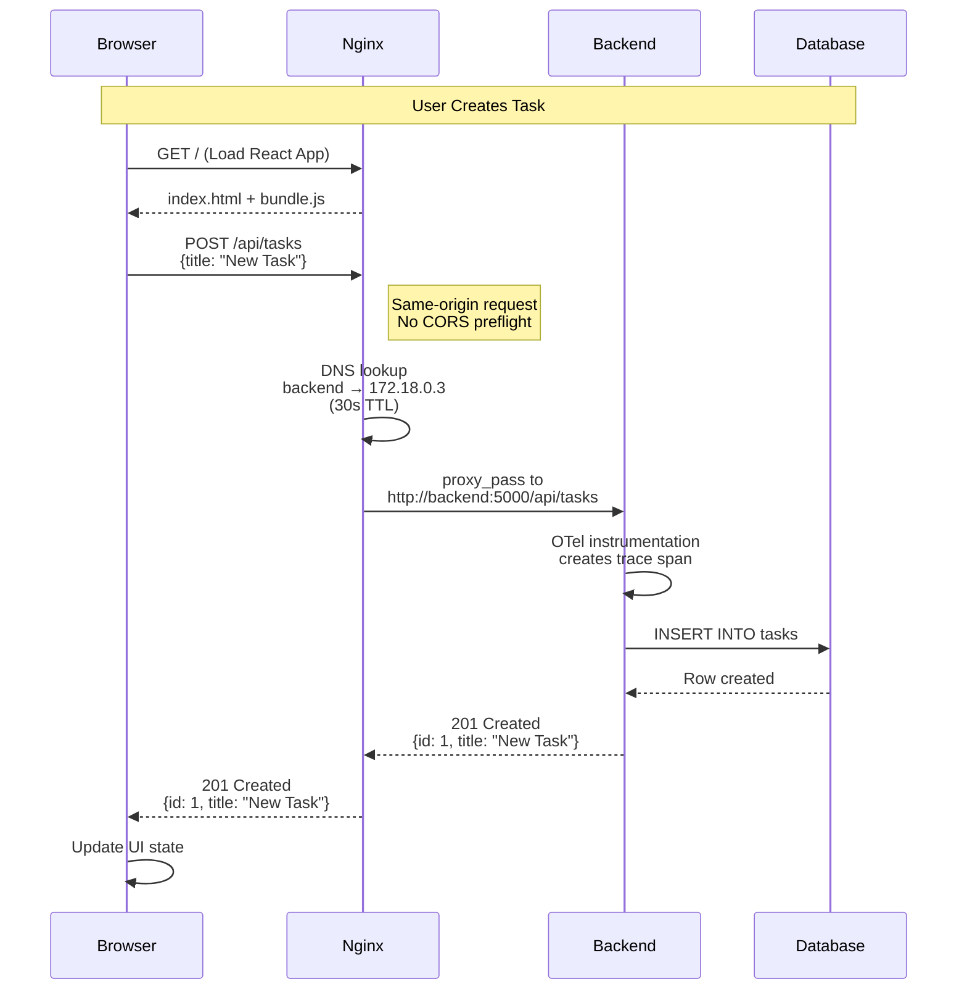

# Network Architecture

**Part of:** [System Architecture Documentation](../ARCHITECTURE.md)
**Related:** [Design Decisions - Network](../DESIGN-DECISIONS.md#network-architecture-decisions)
**Status:** Production-Ready
**Last Updated:** 2025-10-22

---

## Table of Contents

1. [Overview](#overview)
2. [Docker Bridge Network](#docker-bridge-network)
3. [Nginx Reverse Proxy](#nginx-reverse-proxy)
4. [CORS Configuration](#cors-configuration)
5. [Service Discovery and DNS](#service-discovery-and-dns)
6. [Port Mappings](#port-mappings)
7. [Network Security](#network-security)
8. [Implementation Details](#implementation-details)
9. [Troubleshooting](#troubleshooting)
10. [Future Roadmap](#future-roadmap)

---

## Overview

The observability lab uses a **defense-in-depth networking architecture** combining:

1. **Docker Bridge Network** for container isolation and service discovery
2. **Nginx Reverse Proxy** for same-origin API access and backend protection
3. **Hybrid CORS Configuration** (Nginx + Flask) for defensive redundancy
4. **Dynamic DNS Resolution** to handle container restarts gracefully

### Network Topology

```
┌──────────────────────────────────────────────────────────────────┐
│                         Host Network                             │
│                      (192.168.122.250)                           │
│                                                                  │
│  External Access:                                                │
│  - Frontend:    http://192.168.122.250:8080                      │
│  - Grafana:     http://192.168.122.250:3000                      │
│  - Prometheus:  http://192.168.122.250:9090                      │
│                                                                  │
│  ┌────────────────────────────────────────────────────────────┐  │
│  │              Docker Bridge Network (otel-network)          │  │
│  │                    Subnet: 172.18.0.0/16                   │  │
│  │                                                            │  │
│  │  ┌──────────────┐   /api/*    ┌──────────────┐             │  │
│  │  │   Frontend   │─────────────►   Backend    │             │  │
│  │  │ (Nginx:80)   │  Proxy Pass │ (Flask:5000) │             │  │
│  │  │ 172.18.0.2   │◄───────────── 172.18.0.3   │             │  │
│  │  └──────────────┘             └──────┬───────┘             │  │
│  │        │                             │                     │  │
│  │        │ Static Files                │ OTLP Telemetry      │  │
│  │        │                             ▼                     │  │
│  │        │                   ┌─────────────────┐             │  │
│  │        │                   │ OTel Collector  │             │  │
│  │        │                   │   :4318, :4317  │             │  │
│  │        │                   │   172.18.0.4    │             │  │
│  │        │                   └────────┬────────┘             │  │
│  │        │                            │                      │  │
│  │        │          ┌─────────────────┼───────────────┐      │  │
│  │        │          │                 │               │      │  │
│  │        │          ▼                 ▼               ▼      │  │
│  │        │    ┌──────────┐      ┌──────────┐      ┌──────┐   │  │
│  │        │    │Prometheus│      │  Tempo   │      │ Loki │   │  │
│  │        │    │  :9090   │      │  :3200   │      │:3100 │   │  │
│  │        │    └─────┬────┘      └────┬─────┘      └───┬──┘   │  │
│  │        │          │                │                │      │  │
│  │        │          └────────────────┼────────────────┘      │  │
│  │        │                           │                       │  |
│  │        │                           ▼                       │  |
│  │        │                    ┌─────────────┐                │  │
│  │        └───────────────────►│   Grafana   │                │  │
│  │                             │    :3000    │                │  │
│  │                             └─────────────┘                │  │
│  └────────────────────────────────────────────────────────────┘  │
└──────────────────────────────────────────────────────────────────┘
```

### Key Networking Decisions

| Aspect | Choice | Rationale |
|--------|--------|-----------|
| Network Mode | Bridge | Isolation, DNS-based service discovery, port control |
| Proxy Strategy | Nginx Reverse Proxy | Same-origin requests, industry standard, backend protection |
| CORS Approach | Hybrid (Nginx + Flask) | Defense-in-depth, development flexibility |
| DNS Resolution | Dynamic (30s TTL) | Handles container restarts without Nginx reload |
| Service Discovery | Docker DNS (127.0.0.11) | Automatic hostname → IP resolution |

---

## Docker Bridge Network

### Configuration

**Source:** `docker-compose.yml`

```yaml
networks:
  otel-network:
    driver: bridge

services:
  backend:
    networks:
      - otel-network
    # ... all other services also attached to otel-network
```

**Verified Configuration:**
- Network driver: `bridge` ✅
- All 7 services attached to `otel-network` ✅
- Docker automatically creates subnet (typically `172.18.0.0/16`)

### How It Works

1. **Network Namespace Isolation:**
   - Each container has its own network stack (IP, routing table, iptables)
   - Containers cannot directly access host network or other bridge networks

2. **Automatic DNS Resolution:**
   - Docker DNS server (`127.0.0.11`) runs inside each container
   - Service names resolve to current container IPs (e.g., `backend` → `172.18.0.3`)
   - DNS updates automatically when containers restart (IP changes)

3. **Port Mapping:**
   - Containers communicate internally via container ports (e.g., `backend:5000`)
   - Host port mapping (`8080:80`) exposes services externally via iptables NAT

### Why Bridge Over Host/Overlay?

**Bridge Network Advantages:**
- **Isolation:** Port conflicts impossible (each container has its own namespace)
- **Service Discovery:** DNS-based resolution (mirrors Kubernetes networking)
- **Security:** Backend not directly exposed (only frontend and Grafana exposed to host)
- **Standard Pattern:** Matches production architectures

**Rejected Alternatives:**
- **Host Network:** No isolation, port conflicts, no DNS service discovery
- **Overlay Network:** Overkill for single-host lab, requires Swarm mode

**Reference:** [DD-010: Docker Network Mode](../DESIGN-DECISIONS.md#dd-010-docker-network-mode-bridge-vs-host-vs-overlay)

---

## Nginx Reverse Proxy

### Architecture

Nginx serves dual purposes:
1. **Static file server** for React frontend (`/`)
2. **Reverse proxy** for Flask backend API (`/api/*`)

This creates a **same-origin architecture** where frontend and API are both served from `http://192.168.122.250:8080`, eliminating CORS preflight requests in normal operation.

### Request Flow Diagram



**Key Points:**
- **Same-origin**: Both `/` and `/api/tasks` served from port 8080
- **DNS Resolution**: Nginx resolves `backend` via Docker DNS (127.0.0.11)
- **Dynamic Resolution**: 30s TTL prevents stale IP caching
- **Transparent Proxy**: Backend sees original request path `/api/tasks`
- **Telemetry**: Backend instruments request with OTel span

### Configuration

**Source:** `frontend/default.conf`

```nginx
server {
  listen 80;
  server_name _;

  root /usr/share/nginx/html;
  index index.html;

  # Docker DNS resolution with 30s TTL
  resolver 127.0.0.11 ipv6=off valid=30s;

  # Serve React frontend (static files)
  location / {
    try_files $uri $uri/ /index.html;
  }

  # Proxy API requests to Flask backend
  location /api/ {
    # Handle CORS preflight (defensive, usually unnecessary with proxy)
    if ($request_method = OPTIONS) {
      add_header Access-Control-Allow-Origin *;
      add_header Access-Control-Allow-Methods GET,POST,PUT,DELETE,OPTIONS;
      add_header Access-Control-Allow-Headers *;
      return 204;
    }

    # Dynamic DNS resolution (prevents stale IP caching)
    set $backend_upstream http://backend:5000;
    proxy_pass $backend_upstream;

    # Standard proxy headers
    proxy_http_version 1.1;
    proxy_set_header Host $host;
    proxy_set_header X-Real-IP $remote_addr;
    proxy_set_header X-Forwarded-For $proxy_add_x_forwarded_for;
    proxy_set_header X-Forwarded-Proto $scheme;

    # Timeouts
    proxy_connect_timeout 5s;
    proxy_read_timeout 60s;

    # CORS headers (defensive redundancy)
    add_header Access-Control-Allow-Origin *;
    add_header Access-Control-Allow-Methods GET,POST,PUT,DELETE,OPTIONS;
    add_header Access-Control-Allow-Headers *;
  }
}
```

### Key Features

#### 1. Same-Origin Requests

**Frontend Request Flow:**
```javascript
// Frontend code makes request to same origin
fetch('http://192.168.122.250:8080/api/tasks')
  .then(response => response.json())
```

**Browser Perspective:**
- Origin: `http://192.168.122.250:8080`
- Request: `http://192.168.122.250:8080/api/tasks`
- **Result:** Same origin, no CORS preflight needed

**Nginx Processing:**
1. Receives request at `/api/tasks`
2. Resolves `backend` hostname to current IP (e.g., `172.18.0.3:5000`)
3. Proxies request to `http://172.18.0.3:5000/api/tasks`
4. Returns Flask response to browser

#### 2. Proxy Headers

Headers forwarded to backend for request context:

```nginx
proxy_set_header Host $host;                      # Original host (192.168.122.250:8080)
proxy_set_header X-Real-IP $remote_addr;          # Client IP address
proxy_set_header X-Forwarded-For $proxy_add_x_forwarded_for;  # Proxy chain
proxy_set_header X-Forwarded-Proto $scheme;       # http or https
```

**Use Cases:**
- **Logging:** Flask logs show original client IP (not Nginx container IP)
- **Security:** Rate limiting, IP blocking based on real client IP
- **Analytics:** Track user geography, session management

#### 3. Timeout Configuration

```nginx
proxy_connect_timeout 5s;   # Max time to establish connection to backend
proxy_read_timeout 60s;     # Max time to read response from backend
```

**Prevents:**
- Indefinite hanging on backend crashes
- Resource exhaustion from slow clients
- Improves error handling (502 Bad Gateway after timeout)

### Why Reverse Proxy?

**Production-Standard Pattern:**
- Used by Netflix, Uber, Airbnb, Google
- Single entry point for monitoring, rate limiting, WAF
- Backend protected from direct internet access

**Performance:**
- No CORS preflight requests (saves ~100ms per API call)
- Nginx serves static files efficiently (no Flask overhead)

**Security:**
- Backend not exposed to external networks (only frontend exposed)
- Can add authentication, rate limiting, IP blocking at proxy layer

**Reference:** [DD-003: Frontend-Backend Communication](../DESIGN-DECISIONS.md#dd-003-frontend-backend-communication-nginx-proxy-vs-cors-headers)

---

## CORS Configuration

### Hybrid Approach: Defense-in-Depth

Despite using a reverse proxy (which eliminates CORS requirements), this lab implements **both Nginx CORS headers AND Flask-CORS** for defensive redundancy.

### Nginx CORS Headers

**Source:** `frontend/default.conf` (lines 16-18, 34-36)

```nginx
# In OPTIONS preflight handler
if ($request_method = OPTIONS) {
  add_header Access-Control-Allow-Origin *;
  add_header Access-Control-Allow-Methods GET,POST,PUT,DELETE,OPTIONS;
  add_header Access-Control-Allow-Headers *;
  return 204;
}

# In main /api/ location block
add_header Access-Control-Allow-Origin *;
add_header Access-Control-Allow-Methods GET,POST,PUT,DELETE,OPTIONS;
add_header Access-Control-Allow-Headers *;
```

### Flask CORS

**Source:** `backend/app.py` (line 100)

```python
from flask_cors import CORS

app = Flask(__name__)
CORS(app)  # Enables CORS for all routes
```

**Configuration:**
- Default behavior: Allows all origins (`Access-Control-Allow-Origin: *`)
- Installed via `pip install flask-cors`
- Adds headers to every Flask response

### Why Both?

**Normal Operation:**
- Proxy handles 100% of traffic
- CORS headers from Nginx are **technically unnecessary** (same-origin requests)
- Flask CORS headers are **never seen by browser** (request never goes directly to backend)

**Defensive Scenarios:**

1. **Proxy Configuration Breaks:**
   - If Nginx config is corrupted, frontend can fall back to `http://192.168.122.250:5000/api/tasks`
   - Flask CORS allows direct backend access without 403 errors

2. **Development Testing:**
   - Developers can test backend APIs directly via curl, Postman, or browser console
   - No need to disable CORS temporarily

3. **Architecture Evolution:**
   - If frontend moves to CDN (S3 + CloudFront), CORS becomes primary mechanism
   - No code changes needed (already configured)

**Cost:**
- ~100 bytes per response (negligible)
- Minimal maintenance overhead (set once, rarely changed)

**Trade-Off Accepted:**
- Redundant configuration (two places to update if CORS policy changes)
- **But:** Provides fallback capability and future flexibility

**Reference:** [DD-003: Frontend-Backend Communication](../DESIGN-DECISIONS.md#dd-003-frontend-backend-communication-nginx-proxy-vs-cors-headers)

---

## Service Discovery and DNS

### Docker Embedded DNS

Docker runs a DNS server (`127.0.0.11`) inside every container on bridge networks.

**How It Works:**

1. **Service Name Registration:**
   - When `backend` container starts, Docker DNS registers `backend` → `172.18.0.3`
   - When `prometheus` container starts, Docker DNS registers `prometheus` → `172.18.0.5`

2. **DNS Resolution:**
   ```bash
   # Inside frontend container
   $ nslookup backend
   Server:    127.0.0.11
   Address:   127.0.0.11:53

   Name:      backend
   Address:   172.18.0.3
   ```

3. **Dynamic Updates:**
   - If `backend` container restarts, new IP is `172.18.0.7`
   - Docker DNS immediately updates `backend` → `172.18.0.7`
   - All subsequent lookups resolve to new IP

### Nginx Dynamic DNS Resolution

**Problem:** Nginx caches DNS lookups at startup by default.

**Initial Configuration (BROKEN):**
```nginx
location /api/ {
    proxy_pass http://backend:5000/api/;  # Resolved once at Nginx startup
}
```

**Failure Scenario:**
1. Nginx starts, resolves `backend` → `172.18.0.3` (cached)
2. Backend container restarts, new IP is `172.18.0.7`
3. Nginx still proxies to `172.18.0.3` (stale IP)
4. Result: **502 Bad Gateway**

### Solution: Resolver Directive + Variables

**Source:** `frontend/default.conf` (lines 8, 22-23)

```nginx
# Enable Docker DNS with 30s TTL
resolver 127.0.0.11 ipv6=off valid=30s;

location /api/ {
    # Force Nginx to re-resolve on every request
    set $backend_upstream http://backend:5000;
    proxy_pass $backend_upstream;  # Uses variable (dynamic)
}
```

**How This Fixes It:**

1. **Resolver Directive:**
   - Tells Nginx to use Docker DNS (`127.0.0.11`) for hostname resolution
   - `valid=30s` caches DNS result for 30 seconds (balance between performance and freshness)
   - `ipv6=off` disables IPv6 lookups (Docker doesn't use IPv6 by default)

2. **Variable-Based proxy_pass:**
   - `set $backend_upstream http://backend:5000;` forces Nginx to treat hostname as dynamic
   - Nginx re-evaluates variable on every request (with 30s caching)
   - Contrast: `proxy_pass http://backend:5000;` (literal string) is resolved once at startup

**Result:**
- Backend restarts detected within 30 seconds
- No manual Nginx reload required
- Production-ready pattern (used by Kubernetes Ingress)

### Startup Ordering

**Source:** `docker-compose.yml` (lines 119-120)

```yaml
frontend:
  depends_on:
    backend:
      condition: service_healthy
```

**Ensures:**
1. Backend container must start first
2. Backend healthcheck must pass (Flask serving HTTP responses)
3. Only then does frontend container start

**Prevents:**
- Nginx DNS lookup failures at startup (backend not yet running)
- Race condition where Nginx starts before backend is ready

**Reference:** [DD-007: Nginx DNS Resolution](../DESIGN-DECISIONS.md#dd-007-nginx-dns-resolution-static-vs-dynamic)

---

## Port Mappings

### External Access

**Source:** `docker-compose.yml`

| Service | Container Port | Host Port | External URL | Purpose |
|---------|---------------|-----------|--------------|---------|
| frontend | 80 | 8080 | `http://192.168.122.250:8080` | User interface + API proxy |
| backend | 5000 | 5000 | `http://192.168.122.250:5000` | Direct API access (debugging) |
| grafana | 3000 | 3000 | `http://192.168.122.250:3000` | Observability dashboards |
| prometheus | 9090 | 9090 | `http://192.168.122.250:9090` | Metrics query UI |
| loki | 3100 | 3100 | `http://192.168.122.250:3100` | Logs query API |
| tempo | 3200 | 3200 | `http://192.168.122.250:3200` | Traces query API |
| otel-collector | 4317, 4318 | 4317, 4318 | `http://192.168.122.250:4318` | OTLP endpoints |

### Port Mapping Syntax

```yaml
ports:
  - "8080:80"  # host_port:container_port
```

**Breakdown:**
- `8080`: Port on VM host (192.168.122.250:8080)
- `80`: Port inside container (frontend Nginx listens on 80)
- iptables NAT rule: Traffic to `192.168.122.250:8080` → forwarded to `container_ip:80`

### Internal-Only Ports

Some services don't expose ports to the host (internal communication only):

```yaml
otel-collector:
  ports:
    - "4317:4317"  # Exposed to host
    - "4318:4318"  # Exposed to host
    # Port 8888 (metrics) is NOT mapped, only accessible via otel-network
```

**Rationale:**
- Backend can send telemetry to `otel-collector:4318` (internal DNS)
- External monitoring tools can scrape `192.168.122.250:4318` (debugging)
- OTel Collector's own metrics (`:8888`) don't need external access

### Security Implications

**Exposed Ports:**
- Frontend (8080), Grafana (3000), Prometheus (9090) are **intentionally exposed**
- Lab environment (trusted network), no authentication configured

**Production Hardening (Future Phase 2):**
- Remove backend port mapping (`5000:5000`) - force all traffic through Nginx
- Add firewall rules (UFW): Allow only necessary ports
- Implement authentication (OAuth2 for Grafana, BasicAuth for Prometheus)
- Use VPN or SSH tunnel for access (don't expose ports to internet)

---

## Network Security

### Current Security Posture

**Lab Environment Assumptions:**
- VM on isolated KVM network (192.168.122.0/24)
- No direct internet exposure
- Single-user environment (no multi-tenancy)

### Security Layers

#### 1. Container Isolation

**Docker Bridge Network:**
- Each container has separate network namespace
- Cannot access other containers' localhost ports
- Must communicate via explicit network connections

**Example:**
```bash
# Inside backend container
$ curl http://localhost:3000  # FAILS (Grafana not on backend's localhost)
$ curl http://grafana:3000    # WORKS (via otel-network DNS)
```

#### 2. Backend Protection

**Not Directly Exposed:**
- Frontend proxies all API requests
- Clients never connect directly to backend (in normal operation)
- Backend port (5000) exposed only for debugging (could be removed in production)

#### 3. CORS Policy

**Permissive (Lab Environment):**
```nginx
add_header Access-Control-Allow-Origin *;  # Allows all origins
```

**Production Hardening:**
```nginx
# Restrict to specific origins
add_header Access-Control-Allow-Origin https://app.example.com;
add_header Access-Control-Allow-Credentials true;
```

### Future Security Enhancements (Phase 2)

**Planned Hardening:**

1. **Network Segmentation:**
   - Separate networks for frontend/backend vs. observability stack
   - Explicitly define which services can communicate

2. **Authentication:**
   - OAuth2/OIDC for Grafana (Google, GitHub SSO)
   - Prometheus BasicAuth or OAuth2 Proxy
   - API authentication (JWT tokens)

3. **TLS/HTTPS:**
   - Let's Encrypt certificates for external access
   - Internal mTLS for service-to-service communication

4. **Firewall (UFW):**
   ```bash
   sudo ufw allow 22/tcp    # SSH only
   sudo ufw allow 8080/tcp  # Frontend only
   sudo ufw deny 5000/tcp   # Block direct backend access
   sudo ufw enable
   ```

5. **Rate Limiting:**
   ```nginx
   limit_req_zone $binary_remote_addr zone=api:10m rate=10r/s;
   location /api/ {
       limit_req zone=api burst=20 nodelay;
   }
   ```

**Reference:** [DD-011: SSH Authentication Method](../DESIGN-DECISIONS.md#dd-011-ssh-authentication-method-key-only-vs-password-vs-both)

---

## Implementation Details

### Healthcheck Configuration

**Source:** `docker-compose.yml` (lines 17-22)

```yaml
backend:
  healthcheck:
    test: ["CMD", "python", "-c", "import urllib.request; urllib.request.urlopen('http://localhost:5000/metrics', timeout=2).read()"]
    interval: 10s
    timeout: 3s
    retries: 5
    start_period: 5s
```

**Why This Matters for Networking:**
- `depends_on: service_healthy` ensures backend is **actually serving HTTP** before frontend starts
- Tests `/metrics` endpoint (validates Flask is initialized, not just port binding)
- Prevents race condition where Nginx starts before backend is ready

**Parameters:**
- `interval: 10s` - Check every 10 seconds
- `timeout: 3s` - Fail if check takes >3 seconds
- `retries: 5` - Mark unhealthy after 5 consecutive failures
- `start_period: 5s` - Grace period on container start

**Reference:** [DD-008: Backend Healthcheck](../DESIGN-DECISIONS.md#dd-008-backend-healthcheck-http-vs-tcp-vs-python-script)

### Network Diagnostics

**Check DNS Resolution:**
```bash
# From host
docker exec frontend nslookup backend

# Expected output:
# Server:    127.0.0.11
# Address:   127.0.0.11:53
# Name:      backend
# Address:   172.18.0.3
```

**Test Nginx Proxy:**
```bash
# From host
curl http://192.168.122.250:8080/api/tasks

# Should proxy to backend and return JSON task list
```

**Test Direct Backend:**
```bash
# Bypass proxy (test CORS)
curl http://192.168.122.250:5000/api/tasks

# Should return JSON with CORS headers
```

**Inspect Network:**
```bash
# List networks
docker network ls

# Inspect otel-network
docker network inspect lab_otel-network

# Check container IPs
docker inspect -f '{{range .NetworkSettings.Networks}}{{.IPAddress}}{{end}}' backend
```

**Check Nginx DNS Cache:**
```bash
# Force DNS re-resolution by restarting backend
docker restart flask-backend

# Monitor Nginx logs
docker logs -f frontend

# Should see successful proxy requests within 30 seconds
```

---

## Troubleshooting

### Common Issues

#### 1. 502 Bad Gateway (Nginx → Backend)

**Symptoms:**
- Frontend loads, but API calls fail with 502 error
- Nginx error log: `no resolver defined to resolve backend`

**Causes:**
- Missing `resolver 127.0.0.11;` directive in Nginx config
- Backend container not started or crashed
- Backend healthcheck failing

**Solutions:**
```bash
# Check backend status
docker ps | grep backend

# Check backend logs
docker logs flask-backend

# Check backend health
docker inspect flask-backend | grep -A 10 Health

# Test backend directly
curl http://192.168.122.250:5000/health

# Restart backend
docker restart flask-backend
```

#### 2. CORS Errors (Despite Proxy)

**Symptoms:**
- Browser console: `Access to fetch at 'http://...' from origin '...' has been blocked by CORS policy`
- API requests failing in browser DevTools Network tab

**Causes:**
- Frontend making requests to wrong URL (e.g., `http://192.168.122.250:5000` instead of `/api/...`)
- Nginx proxy not forwarding CORS headers

**Solutions:**
```bash
# Check Nginx config syntax
docker exec frontend nginx -t

# Verify CORS headers are present
curl -v http://192.168.122.250:8080/api/tasks | grep -i access-control

# Check frontend code (should use relative paths)
grep -r "fetch.*5000" frontend/  # Should return nothing
```

#### 3. DNS Resolution Failures

**Symptoms:**
- Nginx error: `backend could not be resolved`
- Container startup fails with DNS timeout

**Causes:**
- Resolver directive using wrong DNS server
- Docker DNS not running (127.0.0.11)
- Container not attached to bridge network

**Solutions:**
```bash
# Verify Docker DNS is running (from inside container)
docker exec frontend cat /etc/resolv.conf
# Should show: nameserver 127.0.0.11

# Check network attachment
docker inspect frontend | grep -A 10 Networks

# Test DNS resolution
docker exec frontend nslookup backend
```

#### 4. Port Conflicts

**Symptoms:**
- `docker-compose up` fails with `port is already allocated`
- Service doesn't start

**Causes:**
- Host port already in use by another application
- Previous container not properly cleaned up

**Solutions:**
```bash
# Find process using port 8080
sudo lsof -i :8080

# Kill process or change port mapping in docker-compose.yml
ports:
  - "8081:80"  # Use different host port

# Clean up stopped containers
docker-compose down
docker system prune -f
```

#### 5. Stale IP After Restart

**Symptoms:**
- Backend restarts, but Nginx still tries old IP (502 errors)
- Takes >30 seconds to recover

**Causes:**
- DNS TTL too long (`valid=300s` instead of `valid=30s`)
- Missing variable-based proxy_pass

**Solutions:**
```bash
# Check Nginx config for resolver TTL
docker exec frontend cat /etc/nginx/conf.d/default.conf | grep resolver

# Verify variable usage
docker exec frontend cat /etc/nginx/conf.d/default.conf | grep -A 2 "set.*backend"

# Force immediate DNS refresh
docker restart frontend
```

---

## Future Roadmap

### Phase 2: Enhanced Networking (Q1 2026)

**Network Segmentation:**
```yaml
networks:
  frontend-network:
    driver: bridge
  backend-network:
    driver: bridge
  observability-network:
    driver: bridge

frontend:
  networks:
    - frontend-network
    - backend-network

backend:
  networks:
    - backend-network
    - observability-network
```

**Benefits:**
- Frontend cannot directly access observability stack
- Backend isolated from frontend except through Nginx
- Defense-in-depth against container compromise

**Security Hardening:**
- TLS certificates (Let's Encrypt)
- OAuth2 Proxy for authentication
- Rate limiting (Nginx limit_req)
- Firewall rules (UFW)

### Phase 3: Kubernetes Migration (Q2-Q3 2026)

**Bridge Network → Kubernetes Services:**
```yaml
apiVersion: v1
kind: Service
metadata:
  name: backend
spec:
  selector:
    app: backend
  ports:
    - port: 5000
      targetPort: 5000
  type: ClusterIP  # Internal-only (like bridge network)
```

**Nginx Proxy → Ingress Controller:**
```yaml
apiVersion: networking.k8s.io/v1
kind: Ingress
metadata:
  name: frontend-ingress
spec:
  rules:
    - host: lab.example.com
      http:
        paths:
          - path: /
            pathType: Prefix
            backend:
              service:
                name: frontend
                port:
                  number: 80
          - path: /api
            pathType: Prefix
            backend:
              service:
                name: backend
                port:
                  number: 5000
```

**DNS Resolution → Kubernetes DNS:**
- No manual resolver directive needed
- Kubernetes DNS (CoreDNS) automatically updates service endpoints
- Native support for headless services, service discovery

### Phase 4: Service Mesh (Q4 2026)

**Istio/Linkerd Integration:**
- Mutual TLS (mTLS) for all service-to-service communication
- Traffic splitting (canary deployments, A/B testing)
- Circuit breaking, retries, timeouts (resilience patterns)
- Distributed tracing injection (automatic span propagation)

**Example (Istio VirtualService):**
```yaml
apiVersion: networking.istio.io/v1beta1
kind: VirtualService
metadata:
  name: backend
spec:
  hosts:
    - backend
  http:
    - match:
        - headers:
            canary:
              exact: "true"
      route:
        - destination:
            host: backend
            subset: v2
          weight: 10
        - destination:
            host: backend
            subset: v1
          weight: 90
```

---

## Related Documentation

- **[Main Architecture](../ARCHITECTURE.md)** - System overview and component index
- **[Design Decisions - Network](../DESIGN-DECISIONS.md#network-architecture-decisions)** - Detailed rationale for network choices
- **[Application Architecture](./application.md)** - Frontend and backend implementation
- **[Infrastructure](./infrastructure.md)** - VM and virtualization setup
- **[Observability Architecture](./observability.md)** - Telemetry pipeline details

---

## Nginx Configuration Options

This section provides detailed configuration options for the Nginx reverse proxy, specifically addressing the dynamic DNS resolution pattern used in this architecture.

### The Problem Being Solved

When using Docker Compose, container IPs change on every rebuild/restart. Nginx normally resolves upstream hostnames **once at startup** and caches the IP forever. This causes 502 errors when the backend container gets a new IP after `docker compose restart backend`.

**Solution:** Use Docker's embedded DNS (`127.0.0.11`) + a **variable** in `proxy_pass` to force Nginx to re-resolve the backend hostname on every request.

### The Gotcha: Variables Change Nginx Behavior

When you use a **variable** in `proxy_pass`, Nginx **ignores any URI path** you add after the variable. This is counterintuitive and is the source of confusion.

**Example of the Trap:**
```nginx
# What you might expect:
set $backend http://backend:5000;
proxy_pass $backend/api/;  # ❌ The "/api/" is IGNORED!
```

You'd expect Nginx to append `/api/` to the upstream request, but **it doesn't**. The URI part is silently ignored when using a variable.

### Option 1: Keep `/api` Prefix (Current Implementation)

**What it does:** Passes the full original URI (e.g., `/api/tasks`) to the backend unchanged.

**Configuration:**
```nginx
resolver 127.0.0.11 ipv6=off valid=30s;

location /api/ {
  set $backend_upstream http://backend:5000;
  proxy_pass $backend_upstream;     # ✅ Sends /api/tasks to backend
  proxy_connect_timeout 5s;
  proxy_read_timeout 60s;
  proxy_set_header Host $host;
  proxy_set_header X-Real-IP $remote_addr;
  proxy_set_header X-Forwarded-For $proxy_add_x_forwarded_for;
  proxy_set_header X-Forwarded-Proto $scheme;
}
```

**Request Flow:**
```
Client: GET /api/tasks
  → Nginx: location /api/ matches
  → Nginx: proxy_pass $backend_upstream (no URI specified)
  → Backend receives: /api/tasks (original URI preserved)
  → Flask route: @app.route('/api/tasks') ✅ matches
```

**Why This Works:**
The Flask backend defines routes **with** the `/api` prefix:
```python
# backend/app.py
@app.route('/api/tasks', methods=['GET'])
def get_tasks():
    ...
```

Since Flask expects `/api/tasks`, Nginx should send `/api/tasks`. Option 1 does exactly that.

### Option 2: Strip `/api` Prefix (Alternative)

**What it does:** Removes `/api` from the URI before proxying to backend.

**Configuration:**
```nginx
resolver 127.0.0.11 ipv6=off valid=30s;

location /api/ {
  rewrite ^/api/(.*)$ /$1 break;    # ❌ Extra complexity
  set $backend_upstream http://backend:5000;
  proxy_pass $backend_upstream;     # Sends /tasks (no /api)
  proxy_connect_timeout 5s;
  proxy_read_timeout 60s;
  proxy_set_header Host $host;
  proxy_set_header X-Real-IP $remote_addr;
  proxy_set_header X-Forwarded-For $proxy_add_x_forwarded_for;
  proxy_set_header X-Forwarded-Proto $scheme;
}
```

**When You'd Use This:**
Option 2 is useful if your backend routes are defined **without** the `/api` prefix:
```python
# Hypothetical backend that expects routes WITHOUT /api
@app.route('/tasks', methods=['GET'])  # ← No /api prefix
def get_tasks():
    ...
```

### Configuration Comparison

| Aspect | Option 1: Keep `/api` | Option 2: Strip `/api` |
|--------|----------------------|------------------------|
| **Client Request** | `GET /api/tasks` | `GET /api/tasks` |
| **Nginx Rewrite** | None | `rewrite ^/api/(.*)$ /$1 break;` |
| **URI Sent to Backend** | `/api/tasks` | `/tasks` |
| **Flask Route Needed** | `@app.route('/api/tasks')` | `@app.route('/tasks')` |
| **Complexity** | ✅ Simple | ⚠️ Extra rewrite rule |
| **Matches This Setup** | ✅ Yes (Flask uses `/api/...`) | ❌ No (would break routing) |

### Why Option 1 Was Chosen

1. **Matches existing Flask routes:** The backend already uses `/api/tasks`, `/api/smoke/db`, etc.
2. **Simpler config:** No rewrite rules needed.
3. **Explicit behavior:** The URI path is transparent—what the client sends is what Flask receives.
4. **Easier to debug:** `proxy_pass $backend_upstream` with no URI manipulation is straightforward.

### Key Takeaway: Variables Ignore URI Parts

Remember this rule:
```nginx
# ❌ WRONG (URI part ignored):
set $backend http://backend:5000;
proxy_pass $backend/api/;  # The "/api/" does NOTHING

# ✅ CORRECT (use rewrite if you need to manipulate URI):
set $backend http://backend:5000;
proxy_pass $backend;        # Passes original URI as-is
```

If you need to change the URI when using a variable, use `rewrite` **before** `proxy_pass`.

### Testing Configuration Changes

After modifying Nginx configuration:

```bash
# 1. Reload Nginx to pick up new config
docker compose -p lab restart frontend

# 2. Verify DNS resolution works
docker compose -p lab exec frontend getent hosts backend
# Should show: 172.18.0.X  backend (current IP)

# 3. Test API from within frontend container
docker compose -p lab exec frontend wget -qO- http://backend:5000/api/tasks
# Should return JSON task list

# 4. Test from your host machine (through Nginx proxy)
curl http://192.168.122.250/api/tasks
# Should return JSON task list
```

**See also:** [DD-007: Nginx DNS Resolution](../DESIGN-DECISIONS.md#dd-007-nginx-dns-resolution-static-vs-dynamic)

---

## Future Enhancements

**Planned for Phase 2:**
1. Network segmentation (separate frontend/backend/observability networks)
2. Consider removing backend port mapping (`5000:5000`) in production
3. Document Nginx reload behavior when config changes are made
