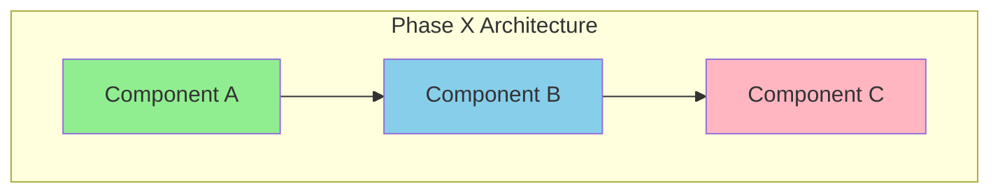

# Phase X Architecture: [Phase Name]

## Overview

**Phase:** X
**Status:** 🚧 In Progress / ✅ Complete / 📋 Planned
**Started:** YYYY-MM-DD
**Completed:** YYYY-MM-DD (if applicable)

[1-2 paragraph summary of what this phase accomplishes and why it matters]

---

## What's New in This Phase

- [ ] **Component/Technology 1:** Brief description
- [ ] **Component/Technology 2:** Brief description
- [ ] **Component/Technology 3:** Brief description
- [ ] **Deprecated:** List anything removed or replaced

**Key Differences from Phase X-1:**
- Change 1
- Change 2
- Change 3

---

## Architecture Diagram



**Legend:**
- 🟢 New in this phase
- 🔵 Modified from Phase X-1
- 🟡 Unchanged from Phase X-1
- 🔴 Deprecated/removed

---

## Component Details

### Component 1: [Name]

**Purpose:** What problem does this solve?

**Technology:** Technology stack used

**Configuration:**
```yaml
# Key configuration snippet
component:
  setting: value
```

**Integration Points:**
- Connects to: [Other components]
- Exposes: [APIs, endpoints, metrics]
- Depends on: [Prerequisites]

**Operational Considerations:**
- Resources: CPU/RAM requirements
- Scaling: Horizontal/vertical limits
- Monitoring: Key metrics to watch

---

### Component 2: [Name]

[Repeat structure above]

---

## Integration with Previous Phases

### Building on Phase X-1

**Retained from Phase X-1:**
- Component A (unchanged)
- Component B (modified - see below)

**Modified from Phase X-1:**
| Component | Change | Reason |
|-----------|--------|--------|
| Component B | Added feature X | To support use case Y |

**Migration Path:**
1. Step 1: Prepare Phase X-1 environment
2. Step 2: Deploy Phase X components
3. Step 3: Cutover from old to new
4. Step 4: Validate
5. Step 5: Decommission old components (if applicable)

---

## Data Flow

### Request Flow

```
Client → Load Balancer → Service A → Service B → Database
          ↓                ↓            ↓
      Metrics          Traces       Logs
          ↓                ↓            ↓
      Prometheus → Tempo ← Loki
```

**Trace Correlation:**
- How traces flow through new components
- Where trace context is propagated

**Metric Collection:**
- What metrics are added in this phase
- How they integrate with existing dashboards

---

## Security Considerations

### New Security Requirements
- Authentication/Authorization changes
- Network policies added
- Secrets management approach

### Compliance
- Standards met (if applicable)
- Audit logging additions

---

## Deployment Architecture

### Infrastructure Requirements

**Compute:**
- VMs/Nodes: X @ Y cores, Z GB RAM
- Total resources: CPU, RAM, Storage

**Network:**
- Ports opened: List
- Firewall rules: List
- Load balancer config: Details

**Storage:**
- Persistent volumes: Size, type
- Backup requirements: Frequency, retention

### High Availability

**Redundancy:**
- Which components are replicated
- Failover mechanisms

**Disaster Recovery:**
- RTO (Recovery Time Objective): Xh
- RPO (Recovery Point Objective): Xh
- Backup/restore procedures

---

## Observability

### Metrics Added

| Metric | Type | Purpose | Alert Threshold |
|--------|------|---------|-----------------|
| `component_requests_total` | Counter | Request rate | N/A |
| `component_duration_seconds` | Histogram | Latency | P95 > 500ms |

### Traces Added

**New Spans:**
- `operation-name`: What it captures

**Attributes:**
- `span.attribute.name`: Description

### Logs Added

**New Log Streams:**
- Component A logs: Format, destination
- Component B logs: Format, destination

**Structured Logging Fields:**
- `field_name`: Purpose

### Dashboards

**New Grafana Dashboards:**
1. **Phase X Overview**: High-level health
2. **Component A Deep Dive**: Detailed metrics
3. **Phase X SLI/SLO**: Service levels

---

## Configuration Management

### Environment Variables

| Variable | Default | Purpose | Required |
|----------|---------|---------|----------|
| `ENV_VAR_1` | `value` | Description | Yes |
| `ENV_VAR_2` | `value` | Description | No |

### Configuration Files

| File | Location | Purpose |
|------|----------|---------|
| `config.yml` | `/etc/app/` | Main configuration |
| `secrets.env` | Vault (planned) | Sensitive data |

---

## Testing Strategy

### Unit Tests
- Coverage target: X%
- Key areas tested

### Integration Tests
- Component interactions tested
- E2E scenarios covered

### Performance Tests
- Load testing approach
- Baseline metrics

---

## Rollback Plan

**Rollback Trigger:**
- Conditions that require rollback

**Rollback Steps:**
1. Stop Phase X components
2. Restore Phase X-1 components
3. Validate Phase X-1 is healthy
4. Update DNS/load balancer
5. Monitor for 24h

**Rollback Time:** Estimated duration

---

## Known Issues & Limitations

### Current Limitations
- [ ] Limitation 1: Description and workaround
- [ ] Limitation 2: Description and workaround

### Future Improvements
- [ ] Enhancement 1: Planned for Phase X+1
- [ ] Enhancement 2: Under investigation

---

## Success Criteria

### Technical Success
- [ ] All components deployed and healthy
- [ ] Integration tests passing
- [ ] Performance benchmarks met
- [ ] Zero critical bugs

### Operational Success
- [ ] Documentation complete
- [ ] Team trained on new components
- [ ] Runbooks created
- [ ] Monitoring/alerting configured

---

## References

### Internal Documentation
- [Phase X-1 Architecture](../phase-X-1/ARCHITECTURE.md)
- [Design Decisions](DESIGN-DECISIONS.md)
- [Implementation Guide](IMPLEMENTATION-GUIDE.md)
- [Troubleshooting](troubleshooting/)

### External Resources
- [Technology Documentation](https://example.com)
- [Best Practices Guide](https://example.com)

---

**Document Version:** 1.0
**Last Updated:** YYYY-MM-DD
**Authors:** Your Name
